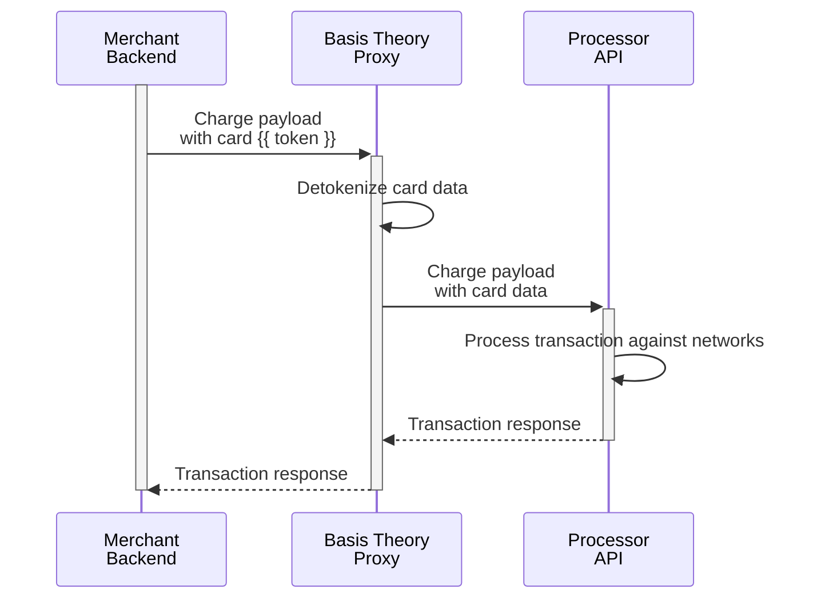

import { Intro } from "@site/src/components/shared/Intro";
import { ApplicationSection } from "@site/src/components/docs/ApplicationSection";
import GettingStartedSection from "@site/src/components/docs/_getting-started-section.mdx";
import FirstChargeSection from "./sections/_first-charge-section.mdx";
import SubsequentChargesSection from "./sections/_subsequent-charges-section.mdx";
import SaveCardSection from "./sections/_save-card-section.mdx";

<Intro
  title="Charge a Card"
  caption="Streamline card transactions with a secure, proxy-powered solution."
/>

Charging a card involves finalizing the transaction by requesting approval from the card networks and issuers to transfer funds. In checkout flows, this operation typically constitutes a Customer-Initiated Transaction (CIT), where the cardholder actively authorizes the payment. Properly flagged CITs help issuers distinguish these transactions from merchant-initiated ones, often leading to higher approval rates and a smoother payment experience.

This guide will show you how to use the Proxy to charge a card with your chosen Payment Service Provider (PSP) while offloading PCI compliance scope with ease. We’ll explore a variety of processor-specific standards and their unique verification quirks, offering practical examples you can adapt to your selected PSP.

If you are not yet collecting your customers' cards with Basis Theory, here are a few guides you can explore:

- [Replace Processor iFrames](/docs/card-payments/replace-processor-iframes) - capture cards in the frontend;
- [Receive Cards via API / Webhooks](/docs/card-payments/receive-cards-api) - receive cards in API requests;

<GettingStartedSection />

### Private Application

<ApplicationSection type="private" permissions={["token:use", "token:create"]} />

<FirstChargeSection />

<SaveCardSection />

<SubsequentChargesSection />
