import CollectCards from "@site/static/img/guides/cards/collect-cards.svg";
import ProcessCards from "@site/static/img/guides/cards/process-cards.svg";
import ReceiveCards from "@site/static/img/guides/cards/receive-cards.svg";
import SetCardPin from "@site/static/img/guides/cards/set-card-pin.svg";
import ThreeDS from "@site/static/img/guides/cards/threeds.svg";
import {Intro} from "@site/src/components/shared/Intro";
import {Card} from "@site/src/components/shared/Card";

<Intro
  title="Card Payments"
  caption="Seamlessly integrate Basis Theory to optimize payments, increase flexibility, and reduce complexity"
  img={{
    light: "/img/guides/cards/logo.svg",
    dark: "/img/guides/cards/logo-dark.svg",
  }}
/>

Adopting Basis Theory

```mermaid
flowchart LR
  id1[Step 1<br>Agnostic Acceptance]
  id2[Step 2<br>Routing & Processing]
  id3[Go live 🚀]
  id4[Step 3<br>Consolidate]
  id5[Step 4<br>Optimize]

  id1 --> id2 --> id3 --> id4 --> id5
```

### Step 1 - Agnostic Acceptance

**One Form. Any Gateway. Maximum Conversions.**

Ensure payment acceptance across multiple gateways while reducing compliance complexity and increasing reliability. By adopting an agnostic approach, you reduce PCI compliance burdens, eliminate the hassle of juggling multiple PSP frontends or iframes, and ensure consistent 3D Secure support—all backed by unbreakable availability with managed fallback options. This step sets the foundation for higher conversions and operational flexibility.

<Card.TwoColumnLayout>
  <Card
    column
    img={<CollectCards/>}
    href="/docs/card-payments/replace-processor-iframes"
    heading="Replace Processor iFrames"
  >Own your card data with modern agnostic elements.</Card>
  <Card
    column
    img={<SetCardPin/>}
    href="/docs/card-payments/recollect-security-code"
    heading="Recolect Security Code"
  >Securely recapture CVC codes for saved cards with a simple, efficient tool.</Card>
  <Card
    column
    img={<ReceiveCards/>}
    href="/docs/card-payments/receive-cards-api"
    heading="Receive Cards via API / Webhooks"
  >Securely receive and store cards sent to your API.</Card>
  <Card
    column
    img={<CollectCards/>}
    href="/docs/card-payments/use-your-own-inputs"
    heading="Use your own Card Inputs"
  >Tokenize with your inputs for flexibility and secure tokenization.</Card>
</Card.TwoColumnLayout>

### Step 2 - Route to your existing processor(s)

**Minimized engineering scope with a future-proofed approach.**

Keep your existing flows and integrations with acquiring APIs while securely routing transactions. This reduces PCI scope and ensures flexibility for future optimizations. By decoupling from specific processors, you protect against risks like processor shutdowns, ensuring long-term stability.

<Card.TwoColumnLayout>
  <Card
    column
    img={<ProcessCards/>}
    href="/docs/card-payments/verify-card"
    heading="Verify a Card"
  >Streamline card verification with a secure, proxy-powered solution.</Card>
  <Card
    column
    img={<ProcessCards/>}
    href="/docs/card-payments/charge-card"
    heading="Charge a Card"
  >Boost approval rates and simplify charges with a flexible, PCI-offloading proxy solution.</Card>
</Card.TwoColumnLayout>

### Step 3 - Consolidate

**Unify Cards. Enable Cross-PSP Routing. Build Smarter Profiles.**

After going live with new card flows, consolidate existing cards into a secure vault to streamline operations, unlock the true potential of fingerprinting and deduplication for unified consumer profiles and seamless cross-PSP routing, and integrate with tools like on-demand data access and point-of-sale systems for greater efficiency.

<Card.TwoColumnLayout>
  <Card
    column
    img={<ProcessCards/>}
    href="/docs/blueprints/migrations/import-cards-on-file"
    heading="Import Cards on File"
  >Effortlessly transfer and secure cards from PSPs into your vault.</Card>
  <Card
    column
    img={<ProcessCards/>}
    href="/docs/blueprints/migrations/import-cards-on-file"
    heading="Back up Your Stripe Tokens"
  >Copy Stripe-collected cards to your agnostic vault.</Card>
</Card.TwoColumnLayout>

[//]: # (TODO: add detokenization APIs and POS)

### Step 4 - Optimize

**Smarter Routing. Lower Costs. Maximum Efficiency.**

Take full control of your payments with dynamic routing and intelligent transaction optimization. Expand your PSP network, reduce costs by minimizing unnecessary declines, and improve approval rates with smarter processing strategies. By leveraging data-driven decisioning, you can fine-tune every transaction to maximize conversions, reduce risk, and create a seamless payment experience.

GUIDES COMING SOON. REACH OUT.

[//]:  # (- Add new PSP)
[//]:  # (- Add routing logic)
[//]:  # (  - Region)
[//]:  # (  - funding type)
[//]:  # (  - Retries)
[//]:  # (- Account Updater)
[//]:  # (- Network Tokens)
[//]:  # (- Use cheaper debit rails to process debit cards)
[//]:  # (- Leverage localized payment processors for cards of a specific region)
[//]:  # (- Prevent accepting cards from high-risk issuers with higher chargeback or fraud rates)

---

[//]:  # (Pick a checkout flow:)

[//]:  # (### Direct Card Payments)

[//]:  # (1. Accept Cards)

[//]:  # (   - &#40;Optional&#41; Authenticate with 3DS)

[//]:  # (2. Charge a new Card)

[//]:  # (   - Produces PSP token, NT TX ID &#40;store them&#41;)

[//]:  # (3. &#40;Optional&#41; Save a Card)

[//]:  # ()
[//]:  # (### Verify and Charge cards)

[//]:  # (1. Accept Cards)

[//]:  # (   - &#40;Optional&#41; Authenticate with 3DS)

[//]:  # (2. Verify a Card)

[//]:  # (   - Produces PSP token, NT TX ID &#40;store them&#41;)

[//]:  # (3. Save a Card)

[//]:  # (   - Produces BT Token ID &#40;store it&#41;)

[//]:  # (4. Charge a Card)

[//]:  # (   - Using PSP Token)

[//]:  # (   - Using BT Token + NT TX ID &#40;fallback&#41;)

[//]:  # ()
[//]:  # (### Pay with Saved Cards)

[//]:  # (1. Using a PSP Token &#40;if you have one&#41;)

[//]:  # (2. Using a BT Token)

[//]:  # (   - Recollect CVC &#40;if needed&#41;)

[//]:  # (   - Charge token)

[//]:  # ()
[//]:  # (---)

[//]:  # ()
[//]:  # (Match your stack:)

[//]:  # ()
[//]:  # (### Frontend guides)

[//]:  # (1. Accept Cards)

[//]:  # (2. Authenticate with 3DS)

[//]:  # (3. Recollect CVC)

[//]:  # ()
[//]:  # (### Backend guides)

[//]:  # (1. Verify a Card)

[//]:  # (2. Charge a new Card)

[//]:  # (3. Save a Card)

[//]:  # (4. Charge a saved Card)
