import CollectCards from "@site/static/img/guides/cards/collect-cards.svg";
import ProcessCards from "@site/static/img/guides/cards/process-cards.svg";
import ReceiveCards from "@site/static/img/guides/cards/receive-cards.svg";
import ExtractCards from "@site/static/img/guides/cards/extract-cards.svg";
import IssueCards from "@site/static/img/guides/cards/issue-cards.svg";
import DisplayCards from "@site/static/img/guides/cards/display-cards.svg";
import SetCardPin from "@site/static/img/guides/cards/set-card-pin.svg";
import ThreeDS from "@site/static/img/guides/cards/threeds.svg";
import { Intro } from "@site/src/components/shared/Intro";
import { Card } from "@site/src/components/shared/Card";

<Intro
  title="Card Payments"
  caption="Learn how to introduce Basis Theory into your Payments Stack"
  img={{
    light: "/img/guides/cards/logo.svg",
    dark: "/img/guides/cards/logo-dark.svg",
  }}
/>

Adopting Basis Theory

```mermaid
flowchart LR
  id1[Step 1<br>Agnostic Acceptance]
  id2[Step 2<br>Routing & Processing]
  id3[Go live 🚀]
  id4[Step 3<br>Consolidate]
  id5[Step 4<br>Optimize]

  id1 --> id2 --> id3 --> id4 --> id5
```

### Step 1 - Agnostic Acceptance

**One Form. Any Gateway. Maximum Conversions.**

Achieving seamless payment acceptance across any gateway starts with simplifying compliance and maximizing reliability. By adopting an agnostic approach, you reduce PCI compliance burdens, eliminate the hassle of juggling multiple PSP frontends or iframes, and ensure consistent 3D Secure support—all backed by unbreakable availability through smart fallback options. This step sets the foundation for higher conversions and operational flexibility.

<Card.TwoColumnLayout>
  <Card
    column
    img={<CollectCards />}
    href="/docs/card-payments/replace-processor-iframes"
    heading="Replace Processor iFrames"
  >Own your card data with modern agnostic elements.</Card>
  <Card
    column
    img={<ThreeDS />}
    href="/docs/guides/process/authenticate-with-3ds"
    heading="Authenticate with 3DS"
  >Securely authenticate transactions with 3D Secure and card tokens.</Card>
  <Card
    column
    img={<SetCardPin />}
    href="/docs/card-payments/recollect-security-code"
    heading="Recolect Security Code"
  >Securely recapture CVC codes for saved cards with a simple, efficient tool.</Card>
  <Card
    column
    img={<ReceiveCards />}
    href="/docs/card-payments/receive-cards-api"
    heading="Receive Cards via API / Webhooks"
  >Securely receive and store cards sent to your API.</Card>
  <Card
    column
    img={<CollectCards />}
    href="/docs/card-payments/use-your-own-inputs"
    heading="Use your own Card Inputs"
  >Tokenize with your inputs for flexibility and secure tokenization.</Card>
  <Card
    column
    img={<SetCardPin />}
    href="/docs/guides/collect/set-card-pin"
    heading="Set Card PIN"
  >Collect Card PIN using customizable UI controls.</Card>
  <Card
    column
    img={<ProcessCards />}
    href="/docs/guides/share/process-card-payments"
    heading="Process Card Payments"
  >Route cards to any Payments Processor API.</Card>
  <Card
    column
    img={<ExtractCards />}
    href="/docs/guides/process/extract-cards"
    heading="Extract Cards"
  >Run OCR algorithms against images to extract card information.</Card>
  <Card
    column
    img={<IssueCards />}
    href="/docs/guides/collect/issue-cards"
    heading="Issue Cards"
  >Securely store issued cards using and Issuer API.</Card>
  <Card
    column
    img={<DisplayCards />}
    href="/docs/guides/share/display-cards"
    heading="Display Cards"
  >Securely display cards to your application users.</Card>

</Card.TwoColumnLayout>

### Step 2 - Route to your existing processor

How
- Verify a Card (and save)
  - Pick a PSP for verification ($0 auth)
- Charge a Card (and save)
  - Add a section about charging existing tokens

### Step 3 - Consolidate
- Bring all cards under the same roof

How
- Migration
- Detokenization APIs
- POS

### Step 4 - Optimize
- Add new PSP
- Add routing logic
  - Region
  - funding type
  - Retries

[//]: # (- Store the last four digits and expiration date to later display to the customer)

[//]: # (- Use cheaper debit rails to process debit cards)

[//]: # (- Leverage localized payment processors for cards of a specific region)

[//]: # (- Prevent accepting cards from high-risk issuers with higher chargeback or fraud rates)

---

Pick a checkout flow:

### Direct Card Payments
1. Accept Cards
   - (Optional) Authenticate with 3DS
2. Charge a new Card
   - Produces PSP token, NT TX ID (store them)
3. (Optional) Save a Card

### Verify and Charge cards
1. Accept Cards
   - (Optional) Authenticate with 3DS
2. Verify a Card
   - Produces PSP token, NT TX ID (store them)
3. Save a Card
   - Produces BT Token ID (store it)
4. Charge a Card
   - Using PSP Token
   - Using BT Token + NT TX ID (fallback)

### Pay with Saved Cards
1. Using a PSP Token (if you have one)
2. Using a BT Token
   - Recollect CVC (if needed)
   - Charge token

---

Match your stack:

### Frontend guides
1. Accept Cards
2. Authenticate with 3DS
3. Recollect CVC

### Backend guides
1. Verify a Card
2. Charge a new Card
3. Save a Card
4. Charge a saved Card
