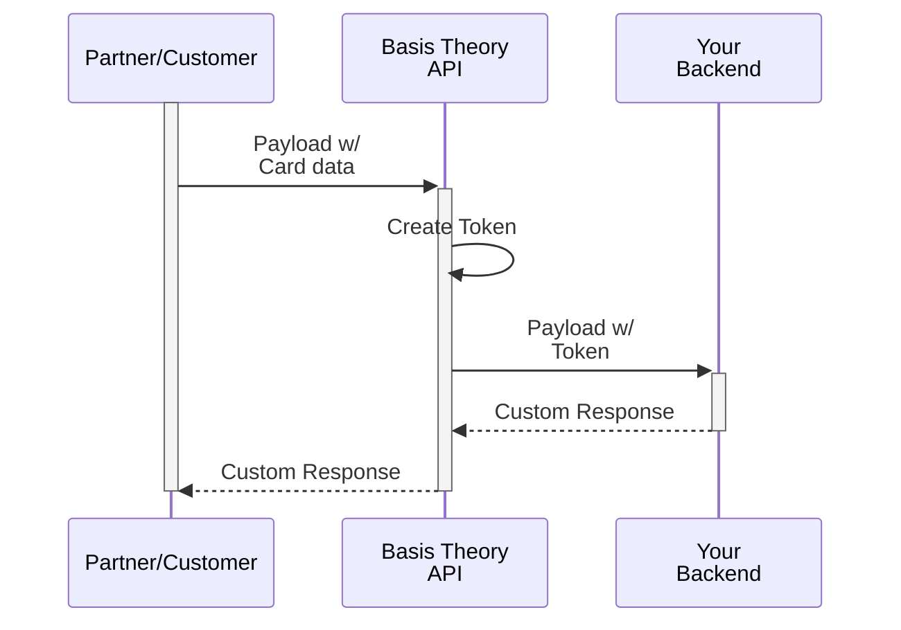

import Tabs from "@theme/Tabs";
import TabItem from "@theme/TabItem";
import GettingStartedSection from "@site/src/components/docs/_getting-started-section.mdx";

import { Alert } from "@site/src/components/shared/Alert";

# Receive Cards via API / Webhooks

When building APIs for various businesses and services like e-commerce platforms, payment processors and facilitators, financial institutions, subscription services, travel and hospitality companies, fintech startups, it may become necessary to receive cardholder data in the request payloads. However, it can be challenging to navigate PCI DSS and ensure that your application meets all the necessary security controls required to comply.

In this guide, we will demonstrate how to set up a Basis Theory Proxy to intercept API requests and webhooks containing cards, while securely storing the cardholder data as tokens with the Basis Theory Platform. Given this guide is followed step by step, you are substantially de-scoping your servers and database from PCI DSS compliance. If you want to learn more how we can help you meet up to 95% of the PCI requirements, or if you need help filling out your SAQ, [reach out to our team](https://basistheory.com/contact)!



<GettingStartedSection />

## Provisioning Resources

In this section, we will explore the bare minimum resources to create a Proxy for your API, that will receive cards and store them securely.

### Management Application

To create all subsequent resources, you will need a [Management Application](/docs/api/applications#application-types).

[Click here](https://portal.basistheory.com/applications/create?name=Resource+Creator&permissions=proxy%3Acreate&permissions=application%3Acreate&type=management) to create a Management Application or [login to your Basis Theory account](https://portal.basistheory.com/applications) and create a new application with the following settings:

- Name - Resource Creator
- Application Type - Management
- Permissions: `application:create`, `proxy:create`

<Alert>Save the API Key from the created Management Application as it will be used later in this guide.</Alert>

### Private Application

Next you will need a [Private Application](/docs/api/applications#application-types) to associate later with the Proxy. This will be used to create card tokens in the vault.

Using the Management Application key to authorize the request, call Basis Theory API to [create a new](/docs/api/applications/#create-application) Private Application:

```shell showLineNumbers
curl "https://api.basistheory.com/applications" \
  -X "POST" \
  -H "BT-API-KEY: <API_KEY>" \
  -H "Content-Type: application/json" \
  -d '{
    "name": "Backend",
    "type": "private",
    "permissions": [ "token:create", "token:read" ]
  }'
```

<Alert>Be sure to replace <code>&lt;API_KEY></code> with the Management API Key you created previously.</Alert>

<Alert>Save the <code>id</code> from the created Private Application as it will be used later in this guide.</Alert>

### Pre-Configured Proxy

Now we will create the Proxy that will listen to HTTP requests containing card data that we need to store in our Basis Theory Tenant. To achieve that, we will leverage a [Request Transform](/docs/api/proxies/pre-configured-proxies#request-transforms) code that handles the request body to tokenize and redact the cardholder data, and include the new token.

The API contract is customizable and can follow any desired format:

<Tabs className="bt-tabs" queryString="content">
  <TabItem value="json" label="JSON">

In this example, we are handling `application/json` content type in the request payload.

```json showLineNumbers title="payload.json"
{
  "reference": "REF1234",
  "currency": "USD",
// highlight-start
  "payment_method": {
    "number": "4242424242424242",
    "expiration_month": 12,
    "expiration_year": 2025,
    "cvc": "123"
  }
// highlight-end
}
```

[//]: # (TODO use the new Node SDK in Reactors)

```javascript showLineNumbers title="requestTransform.js"
module.exports = async function (req) {
  const { bt, args, configuration } = req;
  const { body, headers } = args;

  const { payment_method, ...rest } = body;

  const token = await bt.tokens.create({
    type: 'card',
    data: payment_method,
  })

  return {
      body: {
        payment_method: token,
        ...rest
      },
      headers,
  }
};
```
  </TabItem>
  <TabItem value="xml" label="XML">

In this example, we are handling `application/xml` content type in the request payload.

```xml showLineNumbers title="payload.xml"
<?xml version="1.0" encoding="UTF-8"?>
<Checkout>
    <Reference>REF1234</Reference>
    <Currency>USD</Currency>
// highlight-start
    <PaymentMethod>
        <Number>4242424242424242</Number>
        <ExpirationMonth>12</ExpirationMonth>
        <ExpirationYear>2025</ExpirationYear>
        <Cvc>123</Cvc>
    </PaymentMethod>
// highlight-end
</Checkout>
```
```javascript showLineNumbers title="requestTransform.js"
const { create } = require("xmlbuilder2");

module.exports = async function (req) {
  const {
    bt,
    args: { body, headers },
  } = req;

  // parse the xml
  const doc = create(body);
  // convert it to a Javascript object
  const object = doc.end({ format: "object" });

  const payment_method = {
    number: object.Checkout.PaymentMethod.Number,
    expiration_month: object.Checkout.PaymentMethod.ExpirationMonth,
    expiration_year: object.Checkout.PaymentMethod.ExpirationYear,
    cvc: object.Checkout.PaymentMethod.Cvc,
  }

  const token = await bt.tokens.create({
    type: "card",
    data: payment_method,
  });
  // creates an XML replacing the contents of the <PaymentMethod> tag
  const transformed = create({
    ...object,
    Checkout: {
      ...object.Checkout,
      PaymentMethod: token,
    },
  }).end();

  return {
    body: transformed,
    headers,
  };
};
```
  </TabItem>
  <TabItem value="urlencoded" label="URL Encoded">

In this example, we are handling `application/x-www-form-urlencoded` content type in the request payload.

```text showLines title=payload.txt
reference=REF1234&currency=USD&paymentMethod[number]=4242424242424242&paymentMethod[expirationMonth]=12&paymentMethod[expirationYear]=2025&paymentMethod[cvc]=123
```

```javascript showLineNumbers title=requestTransform.js
const querystring = require('querystring')

module.exports = async function (req) {
  const { bt, args, configuration } = req;
  const { body, headers } = args;

  const {
    'paymentMethod[number]': number,
    'paymentMethod[expirationMonth]': expiration_month,
    'paymentMethod[expirationYear]': expiration_year,
    'paymentMethod[cvc]': cvc,
    ...rest
  } = querystring.parse(body);

  const payment_method = {
    number,
    expiration_month,
    expiration_year,
    cvc
  }

  const token = await bt.tokens.create({
    type: 'card',
    data: payment_method,
  });

  const transformed = querystring.stringify({
    ...rest,
    'paymentMethod[token]': token.id
  })

  return {
    body: transformed,
    headers,
  }
};

```
  </TabItem>
</Tabs>

Let's store the contents of the `requestTransform.js` file into a variable:

```shell showLineNumbers
request_transform_code=$(cat requestTransform.js)
```

And call Basis Theory API to [create the Proxy](/docs/api/proxies#create-a-proxy):

```shell showLineNumbers
curl "https://api.basistheory.com/proxies" \
  -X "POST" \
  -H "BT-API-KEY: <API_KEY>" \
  -H "Content-Type: application/json" \
  -d '{
    "name": "Gateway Proxy",
    "destination_url": "https://echo.basistheory.com/anything",
    "request_transform": {
      "code": '"$(echo $request_transform_code | jq -Rsa .)"'
    },
    "application": {
      "id": "45c124e7-6ab2-4899-b4d9-1388b0ba9d04"
    },
    "require_auth": false
  }'
```

Important things to notice in the request above:

1. `<API_KEY>` is the Management Application Key, used to authenticate the request;
2. `destination_url` should be replaced with your API endpoint;
3. `45c124e7-6ab2-4899-b4d9-1388b0ba9d04` is the id of the Private Application, which is used to initialize the `bt` instance injected in the `req` parameter;
4. `request_transform_code` is passed in plaintext form;
5. `require_auth: false` means that invoking the Proxy won't require a Basis Theory API Key.

<Alert>Save the <code>key</code> from the created Proxy as it will be used later to invoke it.</Alert>

Done! These are all the resources necessary. Let's see how to actually use them.

## Invoking the Proxy

Let's see how your clients or partners would invoke your API through the Proxy.

<Tabs className="bt-tabs" queryString="content">
  <TabItem value="json" label="JSON">

```shell showLineNumbers
curl 'https://api.basistheory.com/proxy' \
  -X 'POST' \
  -H 'Content-Type: application/json' \
  -H 'BT-PROXY-KEY: TDEyQmkhQMpGiZd13FSRQ9' \
  -d '{
    "reference": "REF1234",
    "currency": "USD",
    "payment_method": {
      "number": "4242424242424242",
      "expiration_month": 12,
      "expiration_year": 2025,
      "cvc": "123"
    }
  }'
```
  </TabItem>
  <TabItem value="xml" label="XML">

```shell showLineNumbers
curl 'https://api.basistheory.com/proxy' \
  -X 'POST' \
  -H 'Content-Type: application/xml' \
  -H 'BT-PROXY-KEY: TDEyQmkhQMpGiZd13FSRQ9' \
  -d '<?xml version="1.0" encoding="UTF-8"?>
    <Checkout>
        <Reference>REF1234</Reference>
        <Currency>USD</Currency>
        <PaymentMethod>
            <Number>4242424242424242</Number>
            <ExpirationMonth>12</ExpirationMonth>
            <ExpirationYear>2025</ExpirationYear>
            <Cvc>123</Cvc>
        </PaymentMethod>
    </Checkout>'
```
  </TabItem>
  <TabItem value="urlencoded" label="URL Encoded">

```shell showLineNumbers
curl 'https://api.basistheory.com/proxy' \
  -X 'POST' \
  -H 'Content-Type: application/x-www-form-urlencoded' \
  -H 'BT-PROXY-KEY: TDEyQmkhQMpGiZd13FSRQ9' \
  --data-urlencode 'reference=REF1234' \
  --data-urlencode 'currency=USD' \
  --data-urlencode 'paymentMethod[number]=4242424242424242' \
  --data-urlencode 'paymentMethod[expirationMonth]=12' \
  --data-urlencode 'paymentMethod[expirationYear]=2025' \
  --data-urlencode 'paymentMethod[cvc]=123'
```
  </TabItem>
</Tabs>


<Alert>Be sure to replace <code>TDEyQmkhQMpGiZd13FSRQ9</code> with the Proxy Key you created previously.</Alert>

Your API at `destination_url` will be called with the client-informed payload, except the cardholder data would be replaced by the newly created token.

## Customizing Tokens

The steps so far cover most cases when you need to receive cards in your API and store them in a secure location. However, in some scenarios you may need to customize your card tokens for specific business needs or technical requirements. In the following sections, you will find optional steps to follow for common problems solved by [Basis Theory Token capabilities](/docs/concepts/what-are-tokens#what-are-the-capabilities-of-a-token).

### Deduplication

Companies often find it necessary to uniquely identify cards flowing through their systems for various reasons, which may include: preventing fraudulent transactions, detecting credit cards abuse, building consumer profiles or streamlining payment processing for a better user experience.

By leveraging [token fingerprinting](/docs/concepts/what-are-tokens#fingerprinting), developers can recognize the tokenized data in a customizable fashion, without having to touch with the plaintext data. For cards, it is common to index in the Primary Account Number (PAN). In some cases the expiration date may also be considered.

When making the tokenization request to store the card, pass a fingerprint expression to instruct Basis Theory to calculate the fingerprint for the sensitive data field:


```javascript showLineNumbers title="requestTransform.js"
module.exports = async function (req) {
  ...
  const token = await bt.tokens.create({
    type: 'card',
    data: payment_method,
    // highlight-next-line
    fingerprintExpression: '{{ data.number }}',
  })
  ...
};
```

The new tokens should now have a fingerprint:

```json showLineNumbers title=token.json
{
  "id": "d2cbc1b4-5c3a-45a3-9ee2-392a1c475ab4",
  "type": "card",
  "tenant_id": "15f48eb5-8b52-4cdd-a396-608f7cf001d0",
  "data": {
    "number": "XXXXXXXXXXXX4242",
    "expiration_month": 12,
    "expiration_year": 2025
  },
  "created_by": "4a6ae2a6-79f8-4640-968f-88db913743df",
  "created_at": "2023-04-17T12:54:44.8320458+00:00",
  // highlight-start
  "fingerprint": "CC2XvyoohnqecEq4r3FtXv6MdCx4TbaW1UUTdCCN5MNL",
  "fingerprint_expression": "{{ data.number }}",
  // highlight-end
  "mask": {
    "number": "{{ data.number | reveal_last: 4 }}",
    "expiration_month": "{{ data.expiration_month }}",
    "expiration_year": "{{ data.expiration_year }}"
  },
  "search_indexes": [],
  "containers": [
    "/pci/high/"
  ]
}
```

If you want to prevent creation of a duplicate token based on the distinguishable fingerprint, add the flag below:

```javascript showLineNumbers title="requestTransform.js"
module.exports = async function (req) {
  ...
  const token = await bt.tokens.create({
    type: 'card',
    data: payment_method,
    fingerprintExpression: '{{ data.number }}',
    // highlight-next-line
    deduplicateToken: true,
  })
  ...
};
```

By doing the above, you are instructing Basis Theory to return the existing token if it is found to have the same fingerprint. [Click here to learn more about token deduplication](/docs/concepts/what-are-tokens#deduplication).

### Masking

By default, card tokens are created with a mask revealing only the last 4 digits of the card number. This is useful for generating receipts and payment history, displaying the card to the end-user without revealing the full number, etc.

In other scenarios, being able to preserve the Bank Identification Number (BIN) from the card number can enable fraud detection mechanisms, advanced payment processing routing, account type differentiation and other core functionality. [PCI DSS allows](https://www.pcisecuritystandards.org/faq/articles/Frequently_Asked_Question/What-are-acceptable-formats-for-truncation-of-primary-account-numbers/) applications to reveal up to the first 8 and last 4 digits of a card number, depending on its length and Payment Brand. Luckily, when creating a token, you can express which segments of the PAN are useful to you with a single expressions filter: `card_mask`. [Click here to learn more about this filter](/docs/expressions/filters#card_mask).

```javascript showLineNumbers title="requestTransform.js"
module.exports = async function (req) {
  ...
  const token = await bt.tokens.create({
    type: 'card',
    data: payment_method,
    fingerprintExpression: '{{ data.number }}',
    deduplicateToken: true,
    // highlight-start
    mask: {
      number:'{{ data.number | card_mask: "true", "true" }}',
      expiration_month: '{{ data.expiration_month }}',
      expiration_year: '{{ data.expiration_year }}',
    },
    // highlight-end
  })
  ...
};
```

Now, the created token should also reveal the BIN:

```json showLineNumbers title=token.json
{
  "id": "d2cbc1b4-5c3a-45a3-9ee2-392a1c475ab4",
  "type": "card",
  "tenant_id": "15f48eb5-8b52-4cdd-a396-608f7cf001d0",
  "data": {
    // highlight-next-line
    "number": "42424242XXXX4242",
    "expiration_month": 12,
    "expiration_year": 2025
  },
  "created_by": "4a6ae2a6-79f8-4640-968f-88db913743df",
  "created_at": "2023-04-17T12:54:44.8320458+00:00",
  "fingerprint": "CC2XvyoohnqecEq4r3FtXv6MdCx4TbaW1UUTdCCN5MNL",
  "fingerprint_expression": "{{ data.number }}",
  "mask": {
    // highlight-next-line
    "number": "{{ data.number | card_mask: 'true', 'true' }}",
    "expiration_month": "{{ data.expiration_month }}",
    "expiration_year": "{{ data.expiration_year }}"
  },
  "search_indexes": [],
  "containers": [
    "/pci/high/"
  ]
}
```

In the example above, we instruct Basis Theory to reveal both segments, without having to worry about the card brand or number length. [Click here to learn more about Masking](/docs/expressions/masks).

### Aliasing

While storing or transmitting tokens between systems, you may encounter restrictive technical constraints that can draw the default token Universally Unique Identifier (UUID) incompatible. It is also common to determine your own custom token format when creating a payments API.

In the example below, we will pass a predefined token `id` that follows a custom logic, which resembles an alternative format used in the payments industry. This capability enables Token Portability, and it can be specially useful in migration scenarios.

```javascript showLineNumbers title=requestTransform.js
// highlight-start
function generateTokenId() {
  const chars = 'ABCDEFGHIJKLMNOPQRSTUVWXYZabcdefghijklmnopqrstuvwxyz0123456789';
  let tokenId = 'card_';
  for (let i = 0; i < 24; i++) {
    tokenId += chars.charAt(Math.floor(Math.random() * chars.length));
  }
  return tokenId;
}
// highlight-end

module.exports = async function (req) {
  ...
  const token = await bt.tokens.create({
    // highlight-next-line
    id: generateTokenId(),
    type: 'card',
    data: payment_method,
    fingerprintExpression: '{{ data.number }}',
    deduplicateToken: true,
    mask: {
      number:'{{ data.number | card_mask: "true", "true" }}',
      expiration_month: '{{ data.expiration_month }}',
      expiration_year: '{{ data.expiration_year }}',
    },
  })
  ...
};
```

The returned token object should now have a custom identifier:

```json showLineNumbers title=token.json
{
  // highlight-next-line
  "id": "card_1Mxqr82eZvKYlo2CSaatci3m",
  "type": "card",
  "tenant_id": "15f48eb5-8b52-4cdd-a396-608f7cf001d0",
  "data": {
    "number": "42424242XXXX4242",
    "expiration_month": 12,
    "expiration_year": 2025
  },
  "created_by": "4a6ae2a6-79f8-4640-968f-88db913743df",
  "created_at": "2023-04-17T12:54:44.8320458+00:00",
  "fingerprint": "CC2XvyoohnqecEq4r3FtXv6MdCx4TbaW1UUTdCCN5MNL",
  "fingerprint_expression": "{{ data.number }}",
  "mask": {
    "number": "{{ data.number | card_mask: 'true', 'true' }}",
    "expiration_month": "{{ data.expiration_month }}",
    "expiration_year": "{{ data.expiration_year }}"
  },
  "search_indexes": [],
  "containers": [
    "/pci/high/"
  ]
}
```

Similarly to masking, aliasing also supports passing custom data-bound expressions, that can generate length and format-preserving token identifiers. Doing such increases compatibility to store or pass tokens between systems, white preserving information about the tokenized data.

For example, use the [alias_card](/docs/expressions/filters#alias_card) filter to generate a synthetic card number as a token identifier, which shares the same BIN and last four digits of the real card number. [Click here to learn more about Aliasing](/docs/expressions/aliasing).

## Key Considerations

### Authentication

The Proxy we configured in this guide doesn't require a Basis Theory API Key to be invoked. Most-likely you will need to assert authentication on requests before the Proxy starts processing the payload for tokenization.

To achieve that, you can make a call to your authentication server as the first step in the Request Transform code. For example:

```javascript showLineNumbers title=requestTransform.js
const fetch = require('node-fetch');
const { AuthenticationError } = require('@basis-theory/basis-theory-reactor-formulas-sdk-js');

module.exports = async function (req) {
  const { bt, args, configuration } = req;
  const { body, headers } = args;

  // forwards Authorization header to auth server
  const response = await fetch('https://auth.example.com', {
    method: 'post',
    headers: { 'Authorization': headers['Authorization'] },
  });
  const { authenticated } = await response.json();

  if (!authenticated) {
    // returns a 401 to the requester
    throw new AuthenticationError();
  }

  // do tokenization
  ...
}

```

Alternatively, if you use JSON Web Tokens (JWT), you can verify the JWT's signature using a public key before the Proxy processes the payload for tokenization. This approach eliminates the need for an additional network request to your APIs, streamlining client authentication and improving performance.


```javascript showLineNumbers title=requestTransform.js
const jose = require('node-jose');
const { AuthenticationError } = require('@basis-theory/basis-theory-reactor-formulas-sdk-js');

const verifySignature = async (token, publicKeyPem) => {
  const key = await jose.JWK.asKey(publicKeyPem, "pem");
  const verifier = await jose.JWS.createVerify(key);
  const result = await verifier.verify(token);
  return JSON.parse(result.payload.toString());
};

module.exports = async function (req) {
  const { bt, args, configuration } = req;
  const { body, headers } = args;

  try {
    const jwtPayload = await verifySignature(
      headers['Authorization'], // getting the JWT from the Authorization header
      configuration.PUBLIC_KEY_PEM // getting PEM-encoded RSA public key from the Proxy configuration
    );
  } catch (error) {
    // returns a 401 to the requester
    throw new AuthenticationError();
  }

  // do tokenization
  ...
}

```

### Custom Hostname

Requesting your customers or partners to invoke an API such as `https://api.basistheory.com/proxy?bt-proxy-key=TDEyQmkhQMpGiZd13FSRQ9` may not be the most elegant approach in some circumstances.

If you want to have a custom hostname like `https://secure.yourdomain.com` or `https://payments.yourservice.com` for your Pre-Configured Proxy, follow [these steps](/docs/concepts/what-is-the-proxy#use-a-custom-hostname-for-your-inbound-proxy).

## Conclusion

The best practices prescribed in this guide ensure that your APIs are compliant with the PCI-DSS standards and your clients' sensitive card data is protected. The `token.id` forwarded to your API by the Proxy is a synthetic replacement for the sensitive data and can be safely stored in your database, or transmitted through your systems, meeting compliance requirements and reducing the risk of exposure in case of data breaches.

The optional [customization steps](#customizing-tokens) are meant to showcase platform capabilities that go beyond the examples given. Make sure to explore the provided links within each subsection to learn more about the possibilities for customization.

For next steps, take a look at the following guides to proceed taking the most value of your secured card tokens:

- [Process Card Payments](/docs/guides/share/process-card-payments)
- [Display Cards](/docs/guides/share/display-cards)
- [Search Data](/docs/guides/process/search-data)
- [Analyze Data](/docs/guides/process/analyze-data)
