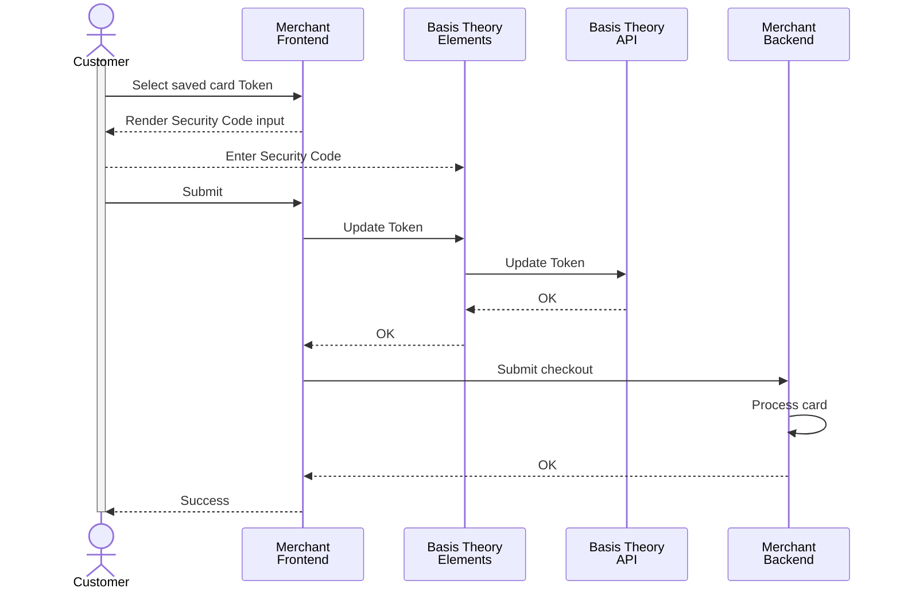

import ConfigureElementsSection from "@site/src/components/docs/_configure-elements-section.mdx";
import { ApplicationSection } from "@site/src/components/docs/ApplicationSection";
import AddCvcElementSection from "./sections/_add-cvc-element-section.mdx";
import UpdateTokenCvcSection from "./sections/_update_token_cvc_section.mdx";
import { AuthenticateCardSection } from "./sections/AuthenticateCardSection";

import { Intro } from "@site/src/components/shared/Intro";

<Intro
  title="Recollect Security Code"
  caption="Securely recapture CVC codes for saved cards with a simple, efficient tool."
/>

To boost authorization rates while adhering to PCI compliance, some Payment Service Providers (PSPs) recommend or mandate that Customer-Initiated Transactions (CITs) with saved cards include the card security code (CSC, also known as CVV or CVC), which cannot be stored in long-term persisted tokens. This guide equips merchants and platforms with the tools to securely recollect the CVC/CVV from customers, enhancing transaction security and meeting PSP requirements. Recollection may be triggered by factors like heightened fraud detection, updated risk policies, card network rules, or regional regulatory changes, ensuring compliance and improved payment success.

### Public Application

<ApplicationSection type="public" permissions={["token:update"]} />

### Configure Elements SDK

<ConfigureElementsSection />

<AddCvcElementSection />

<UpdateTokenCvcSection />

<AuthenticateCardSection type="token"/>

## Next Steps

Now that you've implemented this workflow in your application, the next step is to process payments using the refreshed token.

[Click here](/docs/card-payments/charge-card#using-the-pan) to visit our Charge a Card guide.
