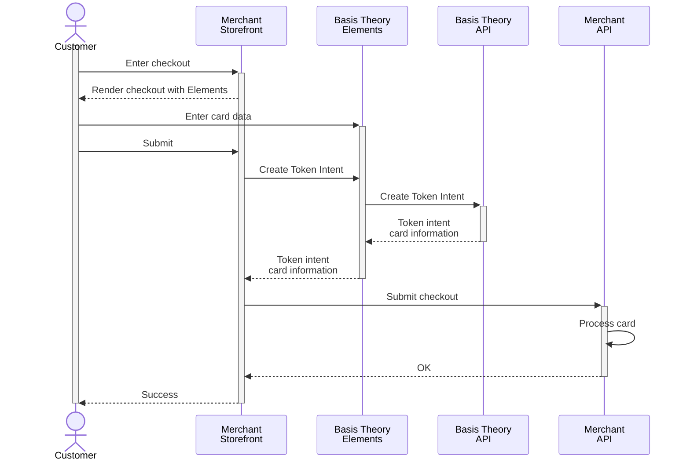

import { Intro } from "@site/src/components/shared/Intro";
import ConfigureElementsSection from "@site/src/components/docs/_configure-elements-section.mdx";
import AddElementsSection from "./sections/_add-card-elements-section.mdx";
import PreTokenizationSection from "./sections/_pre-tokenization-section.mdx";
import AuthenticateCardSection from "./sections/_authenticate-card-section.mdx";
import { ApplicationSection } from "./sections/ApplicationSection";
import GettingStartedSection from "@site/src/components/docs/_getting-started-section.mdx";

<Intro
  title="Replace Processor iFrames"
  caption="Own your card data by replacing processor iFrames with modern agnostic elements."
/>

When handling payments, merchants often rely on processor-specific iFrames to collect cardholder data securely. However, this approach can lead to vendor lock-in, limiting flexibility and control over payment processing. To future-proof their business, merchants need a solution that enables seamless processor switching and true data ownership. Basis Theory empowers businesses to replace processor iFrames with vault-agnostic secure elements, unlocking greater freedom and scalability.

In this guide, you'll learn how to set up Basis Theory SDKs to capture cards in a frontend application, Web or Mobile, and securely store the cardholder data as flexible and agnostic token intents within your Basis Theory vault.

## Scope

- Cards (this guide)
- Banks (link)
- Google Pay and Apple Pay (links)
- Rely on PSP for APMs / LPMs
- Go direct whenever possible (PayPal, etc.)

<GettingStartedSection />

### Public Application

<ApplicationSection type="public" permissions={["token-intent:create"]} />

### Configure Elements SDK

<ConfigureElementsSection />

<AddElementsSection/>

<PreTokenizationSection />

<AuthenticateCardSection />

