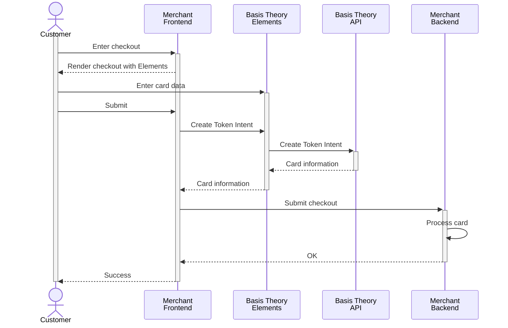

import ConfigureElementsSection from "@site/src/components/docs/_configure-elements-section.mdx";
import { ApplicationSection } from "@site/src/components/docs/ApplicationSection";
import AddElementsSection from "./_add-card-elements-section.mdx";
import TokenizationSection from "./_tokenization-section.mdx";
import { AuthenticateCardSection } from "./AuthenticateCardSection";

## Collect Cards

In this section, we will set up Basis Theory SDKs to capture cards in a frontend application, Web or Mobile, and securely store the cardholder data as flexible and agnostic token intents within your Basis Theory vault.

### Public Application

<ApplicationSection type="public" permissions={["token-intent:create"]}/>

### Configure Elements SDK

<ConfigureElementsSection/>

<AddElementsSection/>

<TokenizationSection/>

<AuthenticateCardSection type="intent"/>
