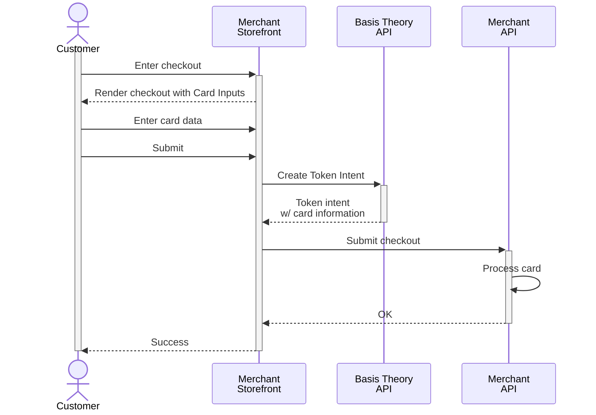

import Tabs from "@theme/Tabs";
import TabItem from "@theme/TabItem";

import { Alert } from "@site/src/components/shared/Alert";
import GettingStartedSection from "@site/src/components/docs/_getting-started-section.mdx";
import { ApplicationSection } from "@site/src/components/docs/ApplicationSection";
import TokenIntentSample from "./sections/_token-intent-sample.mdx";
import AuthenticateCardSection from "./sections/_authenticate-card-section.mdx";

# Use Your Own Card Inputs

Despite Basis Theory Elements being highly customizable and providing the most secure and efficient solution for collecting cards in user-facing applications, we understand that some companies are experienced with PCI DSS and feel comfortable having their frontend, or parts of it, handle cardholder data and be in scope for such compliance.

In this guide, we will set up Basis Theory SDKs to receive cards from your frontend application and securely store the cardholder data as tokens with the Basis Theory Platform. This practice is well-positioned to substantially de-scope your servers, networking resources and database from PCI DSS compliance, while retaining full control of the sensitive data. If you want to learn more how Basis Theory can help you achieve that, [reach out to our team](https://basistheory.com/contact)!



<GettingStartedSection />

### Public Application

<ApplicationSection type="public" permissions={["token-intent:create"]} />

## Tokenization

We won't get into details about particular frontend libraries or custom input implementations, but show how to call the API to store cards in your Basis Theory Tenant.

To do this, we will invoke the [Create Token Intent](https://developers.basistheory.com/docs/api/token-intents#create-token-intent) endpoint from the frontend, passing the cardholder data in the payload. This will securely create a `card` token intent by transferring the card information from your frontend to the Basis Theory API, where the data will be strongly encrypted and stored in a compliant environment.

Let's use a submit function to make the request, triggered from a button:

<Tabs className="bt-tabs" queryString="sdk">
  <TabItem value="javascript" label="JavaScript">

```html showLineNumbers title=index.html
// highlight-next-line
<button onclick="submit();">Submit</button>
```
```javascript showLineNumbers title=index.js
async function submit () {
  try {
    // highlight-start
    const response = await fetch(`https://api.basistheory.com/token-intents`, {
      method: "POST",
      headers: {
        "BT-API-KEY": apiKey,
        "Content-Type": "application/json",
      },
      body: JSON.stringify(cardData),
    });
    // highlight-end
    // store token.id in your database
  } catch (error) {
    console.error(error);
  }
}

init();
```
  </TabItem>
  <TabItem value="react" label="React">

```jsx showLineNumbers title=App.jsx
import {
  useBasisTheory,
} from '@basis-theory/basis-theory-react';

export default function App() {
  const { bt } = useBasisTheory('<API_KEY>');

  const submit = async () => {
    try {
      // highlight-start
      const token = await bt?.tokens.create({
        type: 'card',
        data: {
          number: '4242424242424242',
          expiration_month: 12,
          expiration_year: 2025,
          cvc: '123',
        }
      });
      // highlight-end
      // store token.id in your database
    } catch (error) {
      console.error(error);
    }
  }

  return (
    <>
      ...
      // highlight-next-line
      <button onClick={submit}>Submit</button>
    </>
  );
}
```
  </TabItem>
  <TabItem value="ios" label="iOS">

```swift showLineNumbers title=ViewController.swift
import Foundation
import UIKit
// highlight-next-line
import BasisTheoryElements
import Combine

class ViewController: UIViewController {

    // highlight-start
      @IBAction func tokenize(_ sender: Any) {
        let body: [String: Any] = [
            "type": "card",
            "data": [
                "number": "4242424242424242",
                "expiration_month": 12,
                "expiration_year": 2025,
                "cvc": "123"
            ]
        ]

        BasisTheoryElements.tokenize(body: body, apiKey: "<API_KEY>") { token, error in
            guard error == nil else {
                print(error)
                return
            }
            // store token.id in your database
        }
    }
    // highlight-end

    override func viewDidLoad() { ... }

}
```

  </TabItem>
  <TabItem value="android" label="Android">

```xml showLineNumbers title=activity_main.xml
<?xml version="1.0" encoding="utf-8"?>
<androidx.constraintlayout.widget.ConstraintLayout xmlns:android="http://schemas.android.com/apk/res/android"
    xmlns:app="http://schemas.android.com/apk/res-auto"
    xmlns:tools="http://schemas.android.com/tools"
    android:layout_width="match_parent"
    android:layout_height="match_parent"
    tools:context=".MainActivity">

    <LinearLayout
        android:layout_width="match_parent"
        android:layout_height="wrap_content"
        android:layout_margin="20dp"
        android:orientation="vertical"
        app:layout_constraintEnd_toEndOf="parent"
        app:layout_constraintStart_toStartOf="parent"
        app:layout_constraintTop_toTopOf="parent">

        ...

      // highlight-start
        <Button
            android:id="@+id/submit_button"
            android:layout_width="wrap_content"
            android:layout_height="wrap_content"
            android:layout_marginTop="20dp"
            android:backgroundTint="#00A4BA"
            android:text="Submit" />
      // highlight-end
    </LinearLayout>

</androidx.constraintlayout.widget.ConstraintLayout>
```
```kotlin showLineNumbers title=MainActivity.kt
class MainActivity : AppCompatActivity() {
    // highlight-start
    private lateinit var button: Button;

    private val bt = BasisTheoryElements.builder()
        .apiKey("<API_KEY>")
        .build()
    // highlight-end


    override fun onCreate(savedInstanceState: Bundle?) {
        super.onCreate(savedInstanceState)
        setContentView(R.layout.activity_main)
        // highlight-start
        button = findViewById(R.id.submit_button)
        button.setOnClickListener {
            submit()
        }
        // highlight-end

    }

    // highlight-start
    private fun submit() {
      val token = runBlocking {
        bt.tokens.create(object {
          val type = "card"
          val data = object {
            val number = "4242424242424242"
            val expiration_month = 12
            val expiration_year = 2025
            val cvc = "123"
          }
        })
      }
      // store token.id in your database
    }
    // highlight-end
}
```

  </TabItem>
</Tabs>

<Alert>Be sure to replace <code>&lt;API_KEY></code> with the Public API Key you created in the <a href="#public-application">Public Application</a> step.</Alert>

The created Token Intent is a short-lived tokenized `card` object which carries only non-sensitive information following the [Token Intent Object specification](/docs/api/tokens/token-intents#token-intent-object):

<TokenIntentSample/>

<Alert>You can either post the complete object to your backend for processing or [fetch it using its ID](/docs/api/tokens/token-intents#get-a-token-intent).</Alert>

<AuthenticateCardSection />

## Next Steps

Now that you are securely storing your users' sensitive card data with Basis Theory, the next step is to process payments using your newly tokenized card data. Check out the following guides to complete your integration:

- [Verify a Card](/docs/card-payments/verify-card) – Ensure the card is valid by performing a $0 auth.
- [Charge a Card](/docs/card-payments/charge-card) – Process a payment using the stored token.
