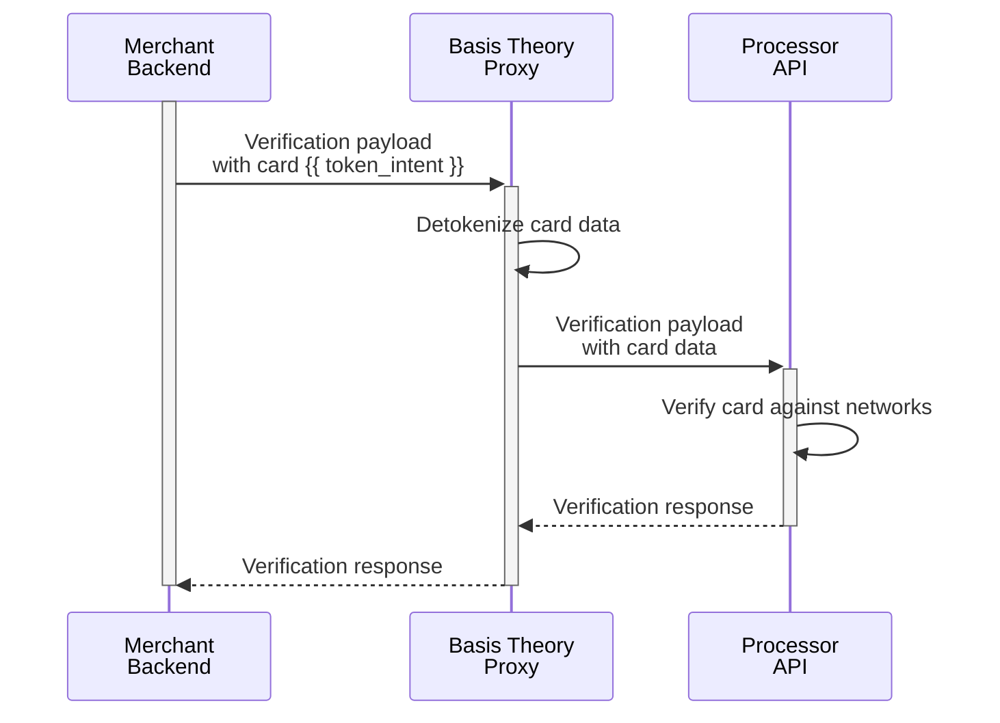

import {Intro} from "@site/src/components/shared/Intro";
import { ApplicationSection } from "@site/src/components/docs/ApplicationSection";
import GettingStartedSection from "@site/src/components/docs/_getting-started-section.mdx";
import SaveCardSection from "./sections/_save-card-section.mdx";
import TokenIntentSample from "./sections/_token-intent-sample.mdx";
import VerifyCardExamples from "./sections/_verify-card-examples.mdx";

<Intro
  title="Verify a Card"
  caption="Streamline card verification with a secure, proxy-powered solution."
/>

Verifying a card is the process of confirming that the card details provided are valid and can be used for transactions. This operation, also known as card authentication, pre-authorization, or $0 authorization, typically involves sending a request to the card networks and issuers to validate the card's number, expiration date, and status. It ensures the card has not been reported lost or stolen and, in some cases, checks the availability of funds or credit.

This guide will show you how to use the Proxy to verify a card with your chosen Payment Service Provider (PSP) while offloading PCI compliance scope with ease. We’ll explore a variety of processor-specific standards and their unique verification quirks, offering practical examples you can adapt to your selected PSP.

If you are not yet collecting your customers' cards with Basis Theory, here are a few guides you can explore:

- [Replace Processor iFrames](/docs/card-payments/replace-processor-iframes) - capture cards in the frontend;
- [Receive Cards via API / Webhooks](/docs/card-payments/receive-cards-api) - receive cards in API requests;

<GettingStartedSection />

### Private Application

<ApplicationSection type="private" permissions={["token:use", "token:create"]} />

## Verify a Card

Different payment service providers (PSPs) may use varying workflows or terminology for this operation ($0 auth or ZDA, account verification, card validation, card ping, etc.). Regardless of the approach, card verification can enhance security, reduces fraud risks, and improves the reliability of payment processing.

Given you have previously created a Token Intent:

<TokenIntentSample />

Here is how you can leverage the [Ephemeral Proxy](/docs/api/proxies/ephemeral-proxy), a tool that transparently performs detokenization, to share the sensitive cardholder data to the Payments Processor or Acquirer API.

<VerifyCardExamples />

<SaveCardSection />
