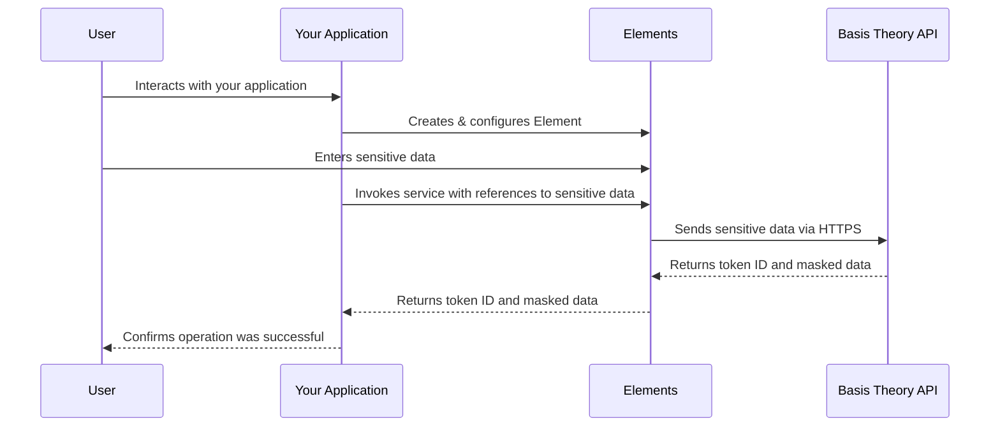

import { SdkCard } from "@site/src/components/sdks/SdkCard";
import { SDK } from "@site/src/components/types";

# Elements

Basis Theory Elements are secure, isolated components that enable your application to collect and reveal sensitive data without directly accessing it. This architecture significantly reduces your compliance scope for standards such as PCI-DSS, HIPAA, SOC 2, and ISO-27001, saving your team time and money on complex audits.

## How Elements Work

Elements function as a secure sandbox within your application, creating a seamless experience for your users while maintaining strict data isolation:

This workflow ensures sensitive data remains isolated from your application code while providing control over styling and user experience.

## Key Benefits

- **Reduced Compliance Scope**: Your application never directly handles sensitive data
- **Seamless User Experience**: Users interact with Elements as if they were native inputs
- **UI/UX Customization**: Customize Elements to match your design system
- **Framework Support**: Available for web and mobile applications

## Collect Sensitive Data

Elements securely capture data entered by your users and tokenize it in the Basis Theory vault without exposing plaintext data to your application.

Our SDKs provide specialized components for various data types:
- [CardElement](/docs/sdks/web/web-elements/components#cardelement) for credit card collection
- [TextElement](/docs/sdks/web/web-elements/components#textelement) for general text input
- And [more specialized Elements](/docs/sdks/web/web-elements/components) for different data types

Each Element can be configured with custom input masking, validation, and transformation rules to meet your specific requirements.

To get started collecting data, choose the guide that fits your technology stack:

- [Collect Data from Web](/docs/guides/collect/collect-data-from-web)
- [Collect Data with React](/docs/guides/collect/collect-data-with-react)
- [Collect Data with Android](/docs/guides/collect/collect-data-with-android)
- [Collect Data with iOS](/docs/guides/collect/collect-data-with-ios)

## Reveal Sensitive Data

Elements can securely display tokenized data to your users without your application accessing the plaintext values.

Using our SDKs, you can retrieve tokens and display their content within your UI while maintaining complete data isolation. Your application only references these values through secure token identifiers.

To start revealing sensitive data to your users, see our [Reveal Tokenized Data](/docs/guides/share/reveal-tokenized-data) guide.

## Elements SDKs

<SdkCard.TwoColumnLayout>
  <SdkCard
    href="/docs/sdks/web/web-elements"
    heading="JavaScript Elements SDK"
    icon={SDK.JAVASCRIPT}
    repository="basis-theory-js"
  />

  <SdkCard
    href="/docs/sdks/web/web-elements"
    heading="React Elements SDK"
    icon={SDK.REACT}
    repository="react-elements"
  />

  <SdkCard
    href="/docs/sdks/mobile/ios"
    heading="iOS Elements"
    sources={{
      light: "/img/sdk/logos/apple.svg",
      dark: "/img/sdk/logos/apple-dark.svg",
    }}
    repository="ios-elements"
  />

  <SdkCard
    href="/docs/sdks/mobile/android"
    heading="Android Elements SDK"
    icon={SDK.ANDROID}
    repository="basistheory-android"
  />
</SdkCard.TwoColumnLayout>