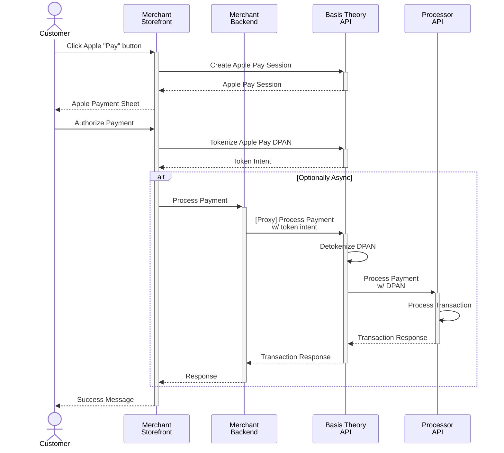

import GettingStartedSection from "@site/src/components/docs/_getting-started-section.mdx";
import { Alert, Alerts } from "@site/src/components/shared/Alert";
import Tabs from "@theme/Tabs";
import TabItem from "@theme/TabItem";
import {ApplicationSection} from "@site/src/components/docs/ApplicationSection";

# Accept Apple Pay Payments

This guide explains how to accept Apple Pay payments using the Basis Theory platform to handle PCI-sensitive data securely.
Let’s begin by reviewing the Apple Pay payment flow.

When the user clicks the Apple "Pay" button, a sequence of high-level steps is initiated:

1. **Creation of an Apple Pay session** - The client application calls Basis Theory to initiate an Apple Pay session.

2. **Decryption of the payment data** - After the user authorizes the payment, the encrypted payment data is sent to Basis Theory for decryption and storage.
   Basis Theory responds with a [Token Intent](/docs/api/tokens/token-intents#token-intent-object) that can be used to process the payment.

3. **Processing of the payment data** - The Basis Theory Token Intents are forwarded to the payment processor via Basis Theory Proxy, which translates Token Intents back to raw data before sending the request.
   Upon receiving a successful payment response, the client application can complete the payment and inform the user that the payment was successful.



## Before you get started

- **Apple Sandbox Environment:**
  - Basis Theory does *not* support Apple's sandbox environment.
  - You must use a real card in your Apple [Wallet](https://support.apple.com/en-us/108398) for testing.

- **Test Tenant Limitations:**
  - For integrations using a test tenant, Basis Theory will not return actual card data.
  - While the Apple Pay token you receive during development is real, the Basis Theory Token Intent will contain simulated data.
  - Only **production tenants** will return real, valid network tokens from Apple Pay tokens.

- **Domain Registration Requirements:**
  - The domain serving your application must be registered with both **Apple** and **Basis Theory**.
  - To complete the registration, a specific file must be accessible by Apple at a predefined path.
  - **File details:**
    - The file’s contents are **not sensitive**.
    - You can download the file from this URL: [https://cdn.basistheory.com/.well-known/apple-developer-merchantid-domain-association](https://cdn.basistheory.com/.well-known/apple-developer-merchantid-domain-association).
    - After downloading, place the file in this exact location on your domain:
      `https://<YOUR_DOMAIN>/.well-known/apple-developer-merchantid-domain-association`.
## Getting Started

<GettingStartedSection/>

## Creating an Apple Pay session

To initiate the payment modal, an Apple Pay session must be started.
Basis Theory integrates with Apple to [request the payment session](https://developer.apple.com/documentation/apple_pay_on_the_web/apple_pay_js_api/requesting_an_apple_pay_payment_session).

<ApplicationSection type="public" permissions={["token-intent:create"]}/>

Let's add the Apple Pay button and modify the `session.onvalidatemerchant` event handler to call Basis Theory and initiate the Apple Pay session.

```html
<html>
<head>
    // highlight-start
    <script crossorigin src="https://applepay.cdn-apple.com/jsapi/1.latest/apple-pay-sdk.js"></script>
    // highlight-end
    <style>
        apple-pay-button {
            --apple-pay-button-width: 194px;
            --apple-pay-button-height: 64px;
            --apple-pay-button-border-radius: 13px;
            --apple-pay-button-padding: 0px 0px;
            --apple-pay-button-box-sizing: border-box;
        }
    </style>

    <script>
        function onApplePayButtonClicked() {
            if (!ApplePaySession) {
                return;
            }

            const session = new ApplePaySession(3, {
                "countryCode": "US",
                "currencyCode": "USD",
                "merchantCapabilities": [
                    "supports3DS"
                ],
                "supportedNetworks": [
                    "visa",
                    "masterCard",
                    "amex",
                    "discover"
                ],
                "total": {
                    "label": "Demo (Card is not charged)",
                    "type": "final",
                    "amount": "1.99"
                }
            });

            // highlight-start
            session.onvalidatemerchant = async event => {
                const merchantSession = await validateMerchant();
                session.completeMerchantValidation(merchantSession);
            };
            // highlight-end

            session.begin();
        }

        // highlight-start
        async function validateMerchant() {
            try {
                const response = await fetch('https://api.basistheory.com/connections/apple-pay/session', {
                    method: 'POST',
                    headers: {
                        'Content-Type': 'application/json',
                        'BT-API-KEY': '<PUBLIC_APPLICATION_KEY>'
                    },
                    body: JSON.stringify({
                        display_name: 'My Store',
                        domain: window.location.host
                    })
                });

                if (!response.ok) {
                    throw new Error(`HTTP error! Status: ${response.status}`);
                }

                const data = await response.json();
                return data;
            } catch (error) {
                console.error('Error validating merchant:', error);
                throw error;
            }
        }
        // highlight-end
    </script>
</head>
<body>

// highlight-start
<apple-pay-button buttonstyle="black" type="plain" locale="en-US"></apple-pay-button>
// highlight-end
<script>
    // Set up the onclick handler for the Apple Pay button
    document.querySelector('apple-pay-button')
        .addEventListener('click', onApplePayButtonClicked);
</script>

</body>
</html>
```

Adding the `apple-pay-sdk.js` script will enable the `<apple-pay-button>` directive to your website.
The `validateMerchant` function calls Basis Theory to initiate the Apple Pay session.

## Tokenization

After the customer has authorized the payment, your application will need to call Basis Theory with the encrypted Apple Pay token.
Let's add the `session.onpaymentauthorized` event to call Basis Theory.

```html
<html>
<head>
    <script crossorigin src="https://applepay.cdn-apple.com/jsapi/1.latest/apple-pay-sdk.js"></script>
    <style>
        apple-pay-button {
            --apple-pay-button-width: 194px;
            --apple-pay-button-height: 64px;
            --apple-pay-button-border-radius: 13px;
            --apple-pay-button-padding: 0px 0px;
            --apple-pay-button-box-sizing: border-box;
        }
    </style>

    <script>
        function onApplePayButtonClicked() {
            if (!ApplePaySession) {
                return;
            }

            const session = new ApplePaySession(3, {
                "countryCode": "US",
                "currencyCode": "USD",
                "merchantCapabilities": [
                    "supports3DS"
                ],
                "supportedNetworks": [
                    "visa",
                    "masterCard",
                    "amex",
                    "discover"
                ],
                "total": {
                    "label": "Demo (Card is not charged)",
                    "type": "final",
                    "amount": "1.99"
                }
            });

            session.onvalidatemerchant = async event => {
                const merchantSession = await validateMerchant();
                session.completeMerchantValidation(merchantSession);
            };

            // highlight-start
            session.onpaymentauthorized = event => {
                performTransaction(event, session);
            };
            // highlight-end

            session.begin();
        }

        async function validateMerchant() {
            try {
                const response = await fetch('https://api.basistheory.com/connections/apple-pay/session', {
                    method: 'POST',
                    headers: {
                        'Content-Type': 'application/json',
                        'BT-API-KEY': '<PUBLIC_APPLICATION_KEY>'
                    },
                    body: JSON.stringify({
                        display_name: 'My Store',
                        domain: window.location.host
                    })
                });

                if (!response.ok) {
                    throw new Error(`HTTP error! Status: ${response.status}`);
                }

                const data = await response.json();
                return data;
            } catch (error) {
                console.error('Error validating merchant:', error);
                throw error;
            }
        }

        // highlight-start
        async function performTransaction(event, session) {
            try {
                const response = await fetch('https://api.basistheory.com/connections/apple-pay/tokenize', {
                    method: 'POST',
                    headers: {
                        'Content-Type': 'application/json',
                        'BT-API-KEY': '<PUBLIC_APPLICATION_KEY>'
                    },
                    body: JSON.stringify({
                        apple_payment_method_token: event.payment.token
                    })
                });

                if (!response.ok) {
                    session.completePayment(ApplePaySession.STATUS_FAILURE);
                    throw new Error(`HTTP error! Status: ${response.status}`);
                }

                const tokenIntent = await response.json().tokent_intent;
                console.log('token intent', tokenIntent);
                session.completePayment(ApplePaySession.STATUS_SUCCESS);
            } catch (error) {
                session.completePayment(ApplePaySession.STATUS_FAILURE);
                throw new Error(`Failed payment`);
            }
        }
      // highlight-end
    </script>
</head>
<body>

<apple-pay-button buttonstyle="black" type="plain" locale="en-US"></apple-pay-button>
<script>
    // Set up the onclick handler for the Apple Pay button
    document.querySelector('apple-pay-button')
        .addEventListener('click', onApplePayButtonClicked);
</script>

</body>
</html>
```

## Processing of the Payment (async)

We'll send the Basis Theory Token Intent to a Payments Service Provider (PSP) to test charging a card.
We'll be doing this from our backend by using a [Proxy](/docs/api/proxies/ephemeral-proxy) and a Private Application.

### Create a Private Application

<ApplicationSection type="private" permissions={["token:use"]}/>

### Charge the Payment

Payment service providers (PSPs) may differ in how they handle this operation, offering workflows like "authorization and capture" or "direct charge."

We'll change our frontend application one last time to pass in the Token Intent ID to the backend to process the payment.

```javascript
async function performTransaction(event, session) {
    try {
        const response = await fetch('https://api.basistheory.com/connections/apple-pay/tokenize', {
            method: 'POST',
            headers: {
                'Content-Type': 'application/json',
                'BT-API-KEY': '<PUBLIC_APPLICATION_KEY>'
            },
            body: JSON.stringify({
                apple_payment_method_token: event.payment.token
            })
        });

        if (!response.ok) {
            session.completePayment(ApplePaySession.STATUS_FAILURE);
            throw new Error(`HTTP error! Status: ${response.status}`);
        }

        const tokenIntent = await response.json().tokent_intent;
        console.log('token intent', tokenIntent);

        // highlight-start
        let { response } = await chargePayment(tokenIntent.id);
        if (!response.ok) {
            session.completePayment(ApplePaySession.STATUS_FAILURE);
            throw new Error(`HTTP error! Status: ${response.status}`)
        }
        // highlight-end
        session.completePayment(ApplePaySession.STATUS_SUCCESS);
    } catch (error) {
        session.completePayment(ApplePaySession.STATUS_FAILURE);
        throw new Error(`Failed payment`);
    }
}

// highlight-start
// Charge Payment in backend
async function chargePayment(tokenIntentId) {
    const response = await fetch('http://localhost:3000/charge-payment', {
        method: 'POST',
        headers: {
            'Content-Type': 'application/json',
        },
        body: JSON.stringify({
            tokenIntentId: tokenIntentId
        })
    });

    return await response;
}
// highlight-end
```

We'll setup and invoke the [ephemeral Proxy](/docs/api/proxies/ephemeral-proxy) on our backend.

<Tabs className="bt-tabs" groupId="processor">
  <TabItem value="javascript" label="Checkout">

  ```shell showlineNumbers title="Charge Payment method through a Proxy"
curl 'https://api.basistheory.com/proxy' \
-X 'POST' \
-H 'Content-Type: application/json' \
// highlight-start
-H 'BT-API-KEY: <PRIVATE_API_KEY>' \
-H 'BT-PROXY-URL: https://api.sandbox.checkout.com/payments' \
-H 'Authorization: Bearer <CHECKOUT_AUTH_TOKEN>' \
// highlight-end
-d '{
  "source": {
    "type": "network_token",
    "token_type": "applepay",
// highlight-start
    "token": "{{ token_intent: <TOKEN_INTENT_ID> | json: \"$.data.number\" }}",
    "expiry_month": "{{ token_intent: <TOKEN_INTENT_ID> | json: \"$.data\" | card_exp: \"MM\" }}",
    "expiry_year": "{{ token_intent: <TOKEN_INTENT_ID> | json: \"$.data\" | card_exp: \"YYYY\" }}",
    "eci": "{{ token_intent: <TOKEN_INTENT_ID> | json: \"$.data.authentication.eci_indicator\" }}",
    "cryptogram": "{{ token_intent: <TOKEN_INTENT_ID> | json: \"$.data.authentication.threeds_cryptogram\" }}"
// highlight-end
  },
  "amount": 1000,
  "currency": "USD",
  "processing_channel_id": "<CHECKOUT_PROCESSING_CHANNEL_ID>"
}'
```
  [Checkout Payment Method Docs](https://www.checkout.com/docs/payments/add-payment-methods/apple-pay/api-only#Request_a_payment).

  </TabItem>
</Tabs>

<Alert>You are not restricted to only using Checkout. You can use any payment processor that accepts Apple Pay tokens.</Alert>

## Preparing for Production

This checklist will guide you through the critical steps you need to follow before moving your Apple Pay integration into production. Ensuring that everything is properly set up and tested reduces the likelihood of errors during live transactions and offers a seamless payment experience to your customers.

### Verify Your Domain

- Download and serve the [domain association file](https://cdn.basistheory.com/.well-known/apple-developer-merchantid-domain-association) on your production server at `https://<YOUR_DOMAIN>/.well-known/apple-developer-merchantid-domain-association`.
- Add the public domain to your tenant using the [Customer Portal](https://portal.basistheory.com/settings?tab=connections) or the [API](/docs/api/connections/apple-pay#register-domain-address)

### Test in Production with a Live Wallet and Card

- Before going live, perform test transactions using a **Live Apple Pay wallet** with a personal or corporate card added. This step ensures that everything is functioning correctly in the production environment with real-world payment methods.
- Keep in mind that Apple Pay in production does not behave the same as in testing, so using live payment information is critical.

### Handling Transaction Failures

When a transaction fails, here’s what you should do:

1. **Check the Error Code**:
   - Look for any error codes returned as part of the failed transaction response. These error codes typically point to the cause of the failure.

2. **Contact Your Payment Processor**:
   - If the error code is unclear, reach out to your **Payment Processor** to diagnose the issue. As processors handle the transaction flow, they often have the most accurate and actionable information about why a transaction may have failed.

3. **Seek Assistance from Basis Theory (if applicable)**:
   - If your integration leverages Basis Theory and you’re unable to resolve the issue with your processor, Basis Theory support can assist in identifying potential issues. However, the **Processor** will usually have the best resources and tools to help address errors swiftly.

### Determine Where to Send Apple Pay Token Payloads

Apple Pay generates a secure token payload for each transaction. It’s essential to configure your integration properly to ensure these tokens are correctly routed. Follow these steps:

1. **Review Processor Documentation**:
   - Check the integration and setup documentation provided by your **Payment Processor** (PSP). They often provide detailed instructions on how and where to send Apple Pay token payloads.

2. **Enable Apple Pay Support with Your PSP**:
   - Some payment processors require you to explicitly enable Apple Pay within their systems. Reach out to your PSP to ensure Apple Pay functionality is activated for your account.

3. **Understand How to Send Tokens**:
   - Each PSP handles Apple Pay tokens differently, so it is critical to:
     - Verify where the token payloads should be sent.
     - Confirm the API endpoints, required headers, and payload formats specific to your PSP.

4. **Contact PSP for Guidance**:
   - If the documentation is unclear, **reach out to your PSP’s support team** to clarify:
     - The process for enabling Apple Pay support.
     - Steps to correctly transmit the token payload for processing.

### Final Notes

- Keep logs of your test transactions in production for future reference.
- Double-check all API keys, certificates, and environment configurations to avoid common production issues.
- If you encounter additional issues or have questions specific to Basis Theory functionality, don’t hesitate to contact Basis Theory’s support team for further assistance.

By following this checklist, you’ll be prepared to seamlessly integrate and go live with Apple Pay, providing a secure and smooth payment experience for your users.
