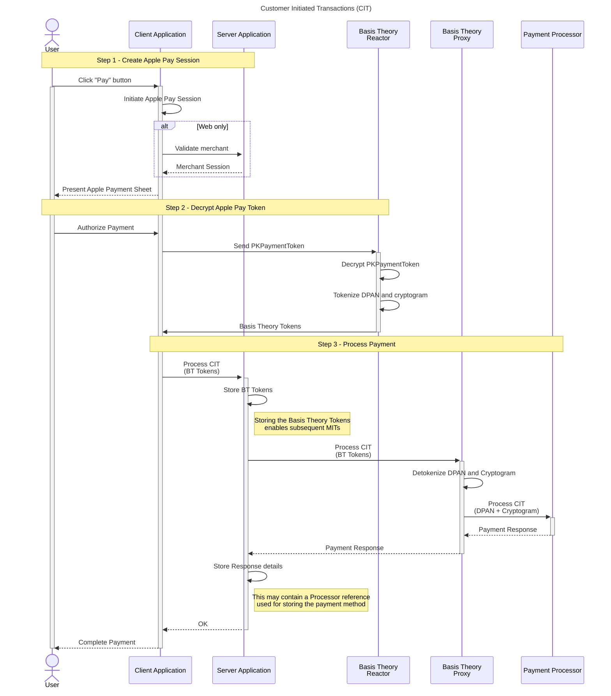
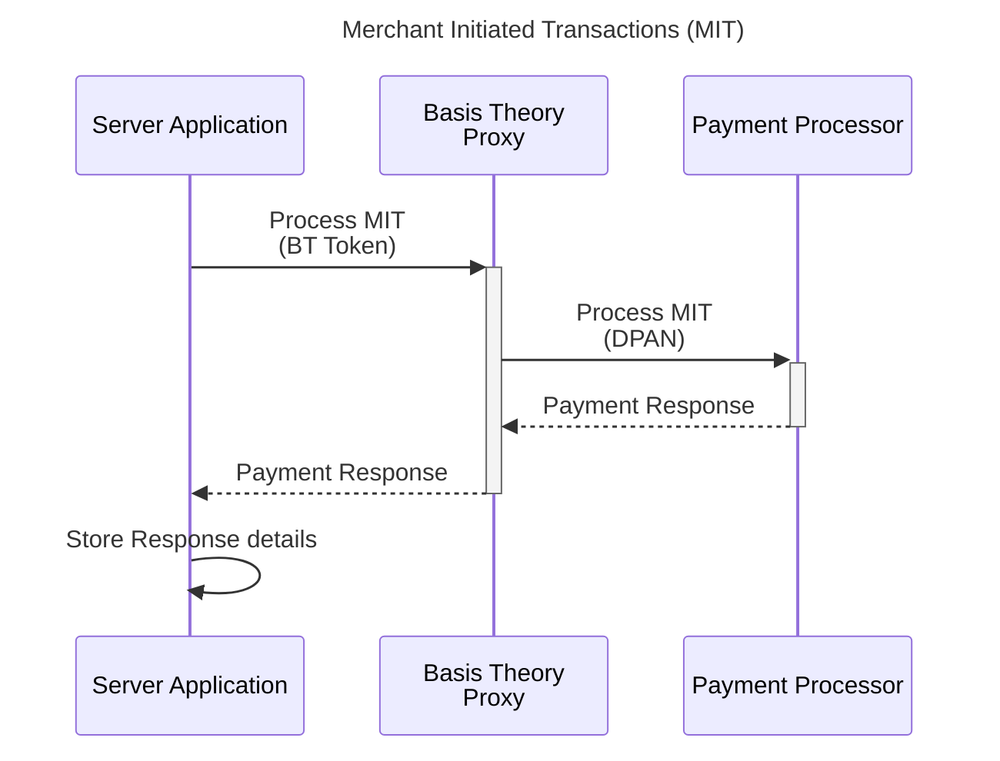

import { Alert, Alerts } from "@site/src/components/shared/Alert";

# Accept Apple Pay

This guide will walk you through the process of accepting Apple Pay in your website or iOS app, while leveraging Basis Theory platform to perform all necessary operations in PCI-sensitive data.

<Alert type={Alerts.INFO}>
  If you haven't yet, please take a look at the [Apple Pay Setup guide](/docs/guides/apple-pay/setup) to make sure you have all the necessary resources in place before you can start integrating.
</Alert>

First let's take a look at the Apple Pay integration workflow of the two types of transactions: Customer Initiated Transactions (CIT) and Merchant Initiated Transactions (MIT).

## Customer Initiated Transactions (CIT)

This type of transaction occurs when the consumer provides their payment details to the merchant, authorizing a specific transaction. Apple Pay has an interface called Payment Sheet, which you can customize to present details about the CIT, such as amount, description of the product(s) or service(s) being sold, coupons, ability to select delivery and billing address, etc.

When the user clicks the Apple "Pay" button, a sequence of interactions is initiated in three high-level steps:

1. Create Apple Pay Session - the client application (iOS or Web) initiates the Apple Pay Session by specifying the Payment Request object to present the Payment Sheet, which can contain both CIT and MIT information. In case of Web, a merchant validation is necessary in the server-side.
2. Decrypt Apple Pay Token - technically referred to as `PKPaymentToken`, this object carries encrypted payment information such as DPAN, expiration date, transaction cryptogram, cardholder name, etc. Decryption and storage of the sensitive cardholder data is performed in Basis Theory environment, to prevent you having any PCI scope in your system.
3. Process Payment - the Basis Theory tokens are forwarded to the Payment Processor via Basis Theory Proxy, which translate them back to raw data before sending the request. When the successful Payment Response returns, the client application can complete the payment with Apple libraries, which plays the satisfying "ding" and ✅ animation for the user.



## Merchant Initiated Transactions (MIT)

This type of transaction occurs when the Merchant process a payment using stored card information, without additional customer validation. It requires a previous CIT to collect consumer authorization. In some cases, the CIT can be a zero-dollar ($0) transaction to verify if the account is active.

Apple's Payment Sheet presented to the customer during the initial CIT workflow can contain information about the MIT, such as recurring billing amount and period, pay later and automatic reload details, etc.

In a single step, merchants can initiate transactions with the Payment Processor using the Basis Theory DPAN Token obtained from the previous workflow.



## Collecting Payment Information

The integration between your client application and Apple can be done directly, without any interference from Basis Theory. Please follow Apple's official guides for [Web](https://developer.apple.com/documentation/apple_pay_on_the_web) ([demo](https://applepaydemo.apple.com/)) and [iOS](https://developer.apple.com/documentation/passkit_apple_pay_and_wallet/apple_pay/offering_apple_pay_in_your_app).

## Provision Resources

In this section, we will explore the bare minimum resources necessary to securely decrypt the Apple Pay Token and use it to process payments.

### Management Application

To create all subsequent resources, you will need a [Management Application](/docs/api/applications#application-types).

[Click here](https://portal.basistheory.com/applications/create?name=Resource+Creator&permissions=reactor%3Acreate&permissions=application%3Acreate&type=management) to create a Management Application or [login to your Basis Theory account](https://portal.basistheory.com/applications) and create a new application with the following settings:

- Name - Resource Creator
- Application Type - Management
- Permissions: `application:create`, `reactor:create`

<Alert>Save the API Key from the created Management Application as it will be used later in this guide.</Alert>

### Private Application

Next you will need a [Private Application](/docs/api/applications#application-types) to create tokens within the Reactor, and invoke it from your servers. This application represents your Server Application.

Using the Management Application key to authorize the request, call Basis Theory API to [create a new](/docs/api/applications/#create-application) Private Application:

```shell showLineNumbers
curl "https://api.basistheory.com/applications" \
  -X "POST" \
  -H "BT-API-KEY: <API_KEY>" \
  -H "Content-Type: application/json" \
  -d '{
    "name": "Server",
    "type": "private",
    "permissions": [ "token:create", "token:read", "token:use" ]
  }'
```

<Alert>Be sure to replace <code>&lt;API_KEY></code> with the Management API Key you created previously.</Alert>

<Alert>Save the <code>key</code> and <code>id</code> from the created Private Application as it will be used later in this guide.</Alert>

### Reactor

## Decrypting PKPaymentToken

### Creating a Session

### Authorizing a Session

### Invoking the Reactor

## Processing Payment

