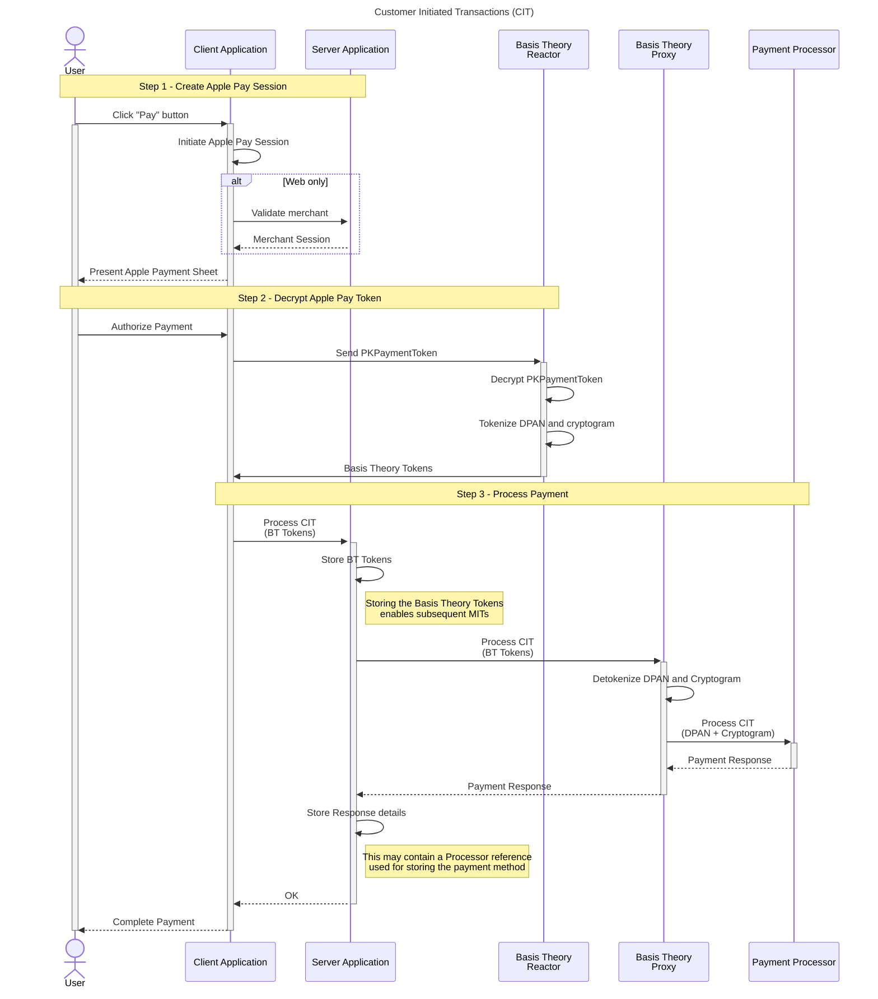
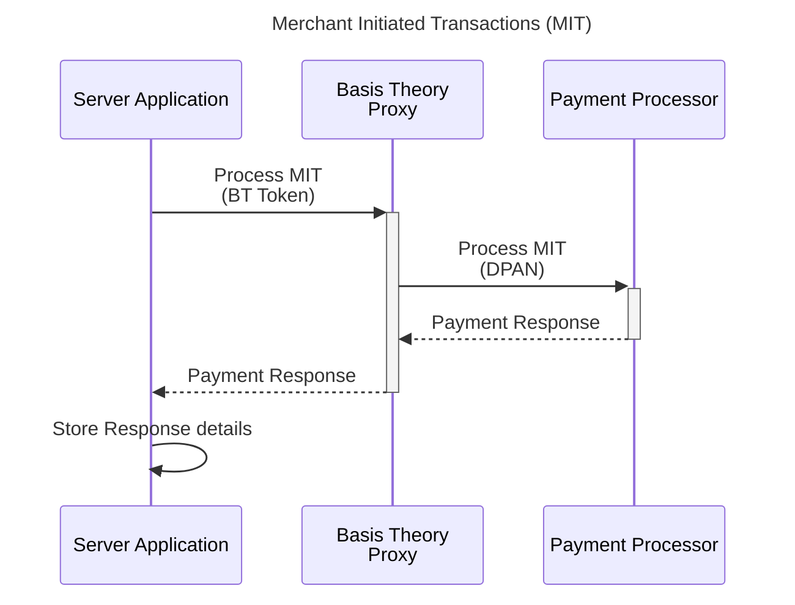

import { Alert, Alerts } from "@site/src/components/shared/Alert";
import Tabs from "@theme/Tabs";
import TabItem from "@theme/TabItem";
import { SdkList } from "@site/src/components/docs/SdkList";


# Accept Apple Pay

This guide will walk you through the process of accepting Apple Pay in your website or iOS app, while leveraging Basis Theory platform to perform all necessary operations in PCI-sensitive data.

<Alert type={Alerts.INFO}>
  If you haven't yet, please take a look at the [Apple Pay Setup guide](/docs/guides/apple-pay/setup) to make sure you have all the necessary resources in place before you can start integrating.
</Alert>

First let's take a look at the Apple Pay integration workflow of the two types of transactions: Customer Initiated Transactions (CIT) and Merchant Initiated Transactions (MIT).

## Customer Initiated Transactions (CIT)

This type of transaction occurs when the consumer provides their payment details to the merchant, authorizing a specific transaction. Apple Pay has an interface called Payment Sheet, which you can customize to present details about the CIT, such as amount, description of the product(s) or service(s) being sold, coupons, ability to select delivery and billing address, etc.

When the user clicks the Apple "Pay" button, a sequence of interactions is initiated in three high-level steps:

1. Create Apple Pay Session - the client application (iOS or Web) initiates the Apple Pay Session by specifying the Payment Request object to present the Payment Sheet, which can contain both CIT and MIT information. In case of Web, a merchant validation is necessary in the server-side.
2. Decrypt Apple Pay Token - technically referred to as `PKPaymentToken`, this object carries encrypted payment information such as DPAN, expiration date, transaction cryptogram, cardholder name, etc. Decryption and storage of the sensitive cardholder data is performed in Basis Theory environment, to prevent you having any PCI scope in your system.
3. Process Payment - the Basis Theory tokens are forwarded to the Payment Processor via Basis Theory Proxy, which translate them back to raw data before sending the request. When the successful Payment Response returns, the client application can complete the payment with Apple libraries, which plays the satisfying "ding" and ✅ animation for the user.



## Merchant Initiated Transactions (MIT)

This type of transaction occurs when the Merchant process a payment using stored card information, without additional customer validation. It requires a previous CIT to collect consumer authorization. In some cases, the CIT can be a zero-dollar ($0) transaction to verify if the account is active.

Apple's Payment Sheet presented to the customer during the initial CIT workflow can contain information about the MIT, such as recurring billing amount and period, pay later and automatic reload details, etc.

In a single step, merchants can initiate transactions with the Payment Processor using the Basis Theory DPAN Token obtained from the previous workflow.



## Collecting Payment Information

The integration between your client application and Apple can be done directly, without any interference from Basis Theory. Please follow Apple's official guides for [Web](https://developer.apple.com/documentation/apple_pay_on_the_web) ([demo](https://applepaydemo.apple.com/)) and [iOS](https://developer.apple.com/documentation/passkit_apple_pay_and_wallet/apple_pay/offering_apple_pay_in_your_app).

## Provision Resources

In this section, we will explore the bare minimum resources necessary to securely decrypt the Apple Pay Token and use it to process payments. You only need to provision resources once per environment.

### Management Application

To create all subsequent resources, you will need a [Management Application](/docs/api/applications#application-types).

[Click here](https://portal.basistheory.com/applications/create?name=Resource+Creator&permissions=reactor%3Acreate&permissions=application%3Acreate&type=management) to create a Management Application or [login to your Basis Theory account](https://portal.basistheory.com/applications) and create a new application with the following settings:

- Name - Resource Creator
- Application Type - Management
- Permissions: `application:create`, `reactor:create`

<Alert>Save the API Key from the created Management Application as it will be used later in this guide.</Alert>

### Public Application

To represent your Client, we'll need a [Public Application](/docs/api/applications#application-types) responsible for creating short-lived [Sessions](/docs/concepts/access-controls#what-are-sessions) that are used to authenticate requests made against Reactors.

Using the Management Application key to authorize the request, call Basis Theory API to [create a new](/docs/api/applications/#create-application) Public Application:

```shell showLineNumbers
curl "https://api.basistheory.com/applications" \
  -X "POST" \
  -H "BT-API-KEY: <API_KEY>" \
  -H "Content-Type: application/json" \
  -d '{
    "name": "Client",
    "type": "public",
    "permissions": []
  }'
```

<Alert>Be sure to replace <code>&lt;API_KEY></code> with the Management API Key you created previously.</Alert>

<Alert>Save the <code>key</code> from the created Public Application as it will be used later in this guide.</Alert>

### Private Application

Next you will need a [Private Application](/docs/api/applications#application-types) to create tokens within the Reactor, and authorize client sessions to invoke it. This application represents your Server.

Using the Management Application key to authorize the request, call Basis Theory API to [create a new](/docs/api/applications/#create-application) Private Application:

```shell showLineNumbers
curl "https://api.basistheory.com/applications" \
  -X "POST" \
  -H "BT-API-KEY: <API_KEY>" \
  -H "Content-Type: application/json" \
  -d '{
    "name": "Server",
    "type": "private",
    "permissions": [ "token:create", "token:use" ]
  }'
```

<Alert>Be sure to replace <code>&lt;API_KEY></code> with the Management API Key you created previously.</Alert>

<Alert>Save the <code>key</code> and <code>id</code> from the created Private Application as it will be used later in this guide.</Alert>

### Reactor

Now let's create a [Reactor](/docs/concepts/what-are-reactors) that can decrypt Apple's `PKPaymentToken` and store the DPAN and cryptogram.

Create a `reactor.js` file and paste the code below. We will use open source [Basis Theory Apple Pay utility](https://www.npmjs.com/package/@basis-theory/apple-pay-js) to easily create a context and perform decryption.

```javascript title="reactor.js" showLineNumbers
const { Buffer } = require('buffer');
const { ApplePaymentTokenContext } = require('@basis-theory/apple-pay-js');
const {
  CustomHttpResponseError,
} = require('@basis-theory/basis-theory-reactor-formulas-sdk-js');

module.exports = async function (req) {
  const {
    bt,
    args: {
      applePayToken: { paymentData, ...restApplePayToken },
    },
    configuration: {
      MERCHANT_IDENTITY_CERTIFICATE_PEM,
      PAYMENT_PROCESSING_PRIVATE_KEY_PEM
    },
  } = req;

  // creates token context from certificates / keys configured in Reactor
  const context = new ApplePaymentTokenContext({
    merchants: [
      {
        certificatePem: Buffer.from(MERCHANT_IDENTITY_CERTIFICATE_PEM),
        privateKeyPem: Buffer.from(PAYMENT_PROCESSING_PRIVATE_KEY_PEM)
      }
      // add more certificates to perform automatic key rotation
    ]
  });

  try {
    // decrypts Apple's PKPaymentToken paymentData
    const {
      applicationPrimaryAccountNumber,
      applicationExpirationDate,
      onlinePaymentCryptogram,
      ...restPaymentData
    } = context.decrypt(paymentData);

    // vaults DPAN and cryptogram
    const { panToken, cryptogramToken } = await bt.tokenize({
      panToken: {
        type: 'card',
        data: {
          number: applicationPrimaryAccountNumber,
          expiration_month: applicationExpirationDate.slice(2, 4),
          expiration_year: `20${applicationExpirationDate.slice(-2)}`
        }
      },
      cryptogramToken: {
        type: 'token',
        containers: ['/pci/high'],
        data: onlinePaymentCryptogram
      }
    });

    // returns transaction details and vaulted tokens, without any sensitive PCI data
    return {
      raw: {
        panToken,
        cryptogramToken,
        applePayToken: {
          paymentData: restPaymentData,
          ...restApplePayToken
        }
      }
    };
  } catch (error) {
    throw new CustomHttpResponseError({
      status: 500,
      body: {
        message: error.message
      }
    });
  }
};
```

Let's store the contents of the `reactor.js` file into a variable:

```shell showLineNumbers
reactor_code=$(cat reactor.js)
```

And call Basis Theory API to create the Reactor:

```shell showLineNumbers
curl "https://api.basistheory.com/reactors" \
  -H "BT-API-KEY: <API_KEY>" \
  -H "Content-Type: application/json" \
  -X "POST" \
  -d '{
    "name": "Apple Pay Reactor",
    "code": '"$(echo $reactor_code | jq -Rsa .)"',
    "configuration": {
      "MERCHANT_IDENTITY_CERTIFICATE_PEM": "-----BEGIN CERTIFICATE-----\nMIIEdTCCBBugAwIBAgIIc5onAJBqqpk...",
      "PAYMENT_PROCESSING_PRIVATE_KEY_PEM": "-----BEGIN EC PARAMETERS-----\nBggqhkjOPQMBBw==..."
    },
    "application": {
      "id": "<APPLICATION_ID>"
    }
  }'
```

Important things to notice in the request above:

1. `<API_KEY>` is the Management Application Key, used to authenticate the request
2. `code` is passed in plain text form
3. Merchant Identifier Certificate and Payment Processing Private Key are passed in plain text form as configuration entries

<Alert>Save the <code>id</code> from the created Reactor as it will be used later to invoke it.</Alert>

Done! These are all the resources necessary. Let's see how to use them.

## Decrypting PKPaymentToken

In this section, we will explore how the integration looks like for both the client and server applications.

### Creating a Session

Chose your preferred language for your client application, and click below for detailed instructions on how to install and configure the SDK.

<SdkList type="client" />

To invoke a Reactor, first we need to create a [Session](/docs/api/applications/sessions) to grant temporary access to our Public Application. It is good practice to create the session when the user enters the checkout page, so it is ready by the time they click on the "Pay" button.

<Tabs className="bt-tabs" queryString="frontend">
  <TabItem value="javascript" label="JavaScript">

```javascript showLineNumbers title=index.js
import { BasisTheory } from '@basis-theory/basis-theory-js';

let bt;
let sessionKey;

async function init () {
  try {
    bt = await new BasisTheory().init("<API_KEY>");
    // highlight-next-line
    const session = await bt.sessions.create();
    sessionKey = session.sessionKey;
  } catch (error) {
    console.error(error);
  }
}

init();
```

  </TabItem>
  <TabItem value="react" label="React">

```jsx showLineNumbers title=App.jsx
import React, { useState } from "react";
import { useBasisTheory } from "@basis-theory/basis-theory-react";

export default function App() {
  const { bt } = useBasisTheory("<API_KEY>");
  const [sessionKey, setSessionKey] = useState();

  useEffect(() => {
    if (bt) {
    // highlight-next-line
      const session = await bt.sessions.create();
      setSessionKey(session.sessionKey);
    }
  }, [bt]);
}
```

  </TabItem>
  <TabItem value="ios" label="iOS">

```swift showLineNumbers title=ViewController.swift
import Foundation
import UIKit
import BasisTheoryElements
import Combine

class ViewController: UIViewController {
    private var sessionKey: String = ""

    override func viewDidLoad() {
    // highlight-next-line
        BasisTheoryElements.createSession(apiKey: "<API_KEY>") { data, error in
            self.sessionKey = data!.sessionKey!
            let nonce = data!.nonce!
        }
    }
}
```

  </TabItem>
  <TabItem value="android" label="Android">

```kotlin showLineNumbers title=MainActivity.kt
import com.basistheory.android.service.BasisTheoryElements
import com.basistheory.android.model.CreateSessionResponse

class MainActivity : AppCompatActivity() {

    private lateinit var sessionKey: String;

    override fun onCreate(savedInstanceState: Bundle?) {
        super.onCreate(savedInstanceState)
        setContentView(R.layout.activity_main)

        val bt = BasisTheoryElements.builder()
          .apiKey("<API_KEY>")
          .build()

        // highlight-next-line
        this.sessionKey = bt.createSession().sessionKey
    }
}
```

  </TabItem>

   <TabItem value="react-native" label="React Native">

```typescript showLineNumbers title=App.tsx
import React, { useState } from "react";
import { useBasisTheory } from "@basis-theory/basis-theory-react-native";

export default function App() {
  const { bt } = useBasisTheory("<API_KEY>");
  const [sessionKey, setSessionKey] = useState();

  useEffect(() => {
    if (bt) {
     // highlight-next-line
      const session = await bt.sessions.create();
      setSessionKey(session.sessionKey);
    }
  }, [bt]);
}
```

  </TabItem>
</Tabs>

<Alert>Be sure to replace <code>&lt;API_KEY></code> with the Public API Key you created previously.</Alert>


### Authorizing a Session

Sessions must be [authorized](/docs/api/applications/sessions#authorize-session) by a Private Application to perform any protected actions. In our case, we want to allow it to invoke the Apple Pay Reactor to decrypt and tokenize the card information.

We will add a new `/authorize` endpoint to our backend that receives the session `nonce` and authorizes it with the `token:use` permission.


### Invoking the Reactor

## Processing Payment

