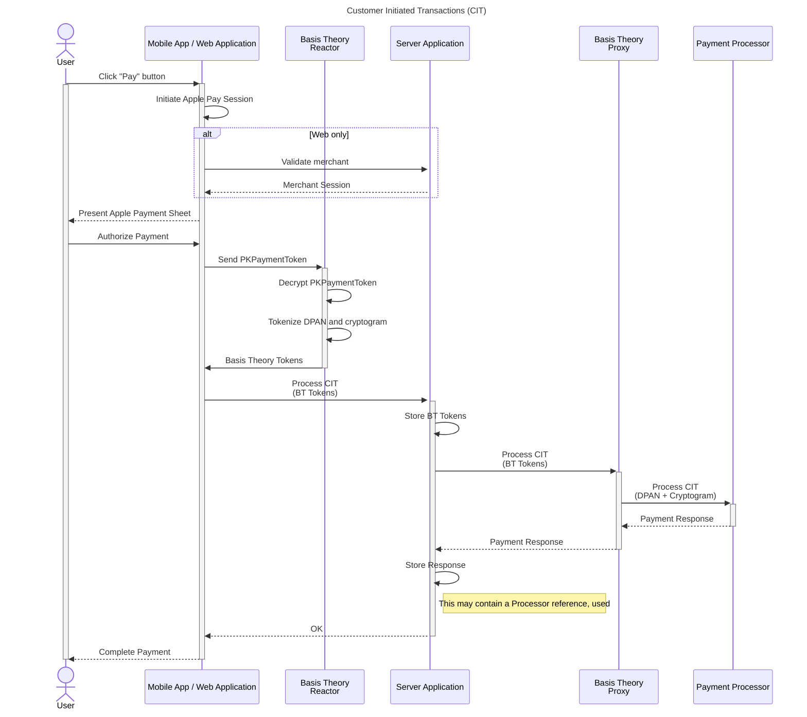
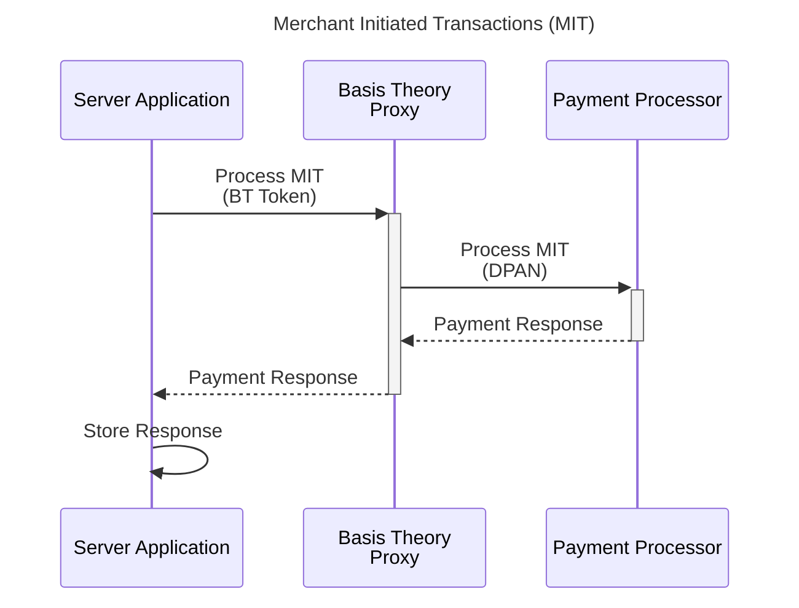

# Accept Apple Pay

If you haven't yet, please take a look at the [Apple Pay Setup page](/docs/guides/apple-pay/setup) to make sure you have all the necessary resources in place before you can start integrating.

## Capturing User Payment

TODO: official links

## Provision Resources

### Management Application

### Private Application

### Pre-configured Proxy

## Decrypting PKPaymentToken

## Processing Payment

