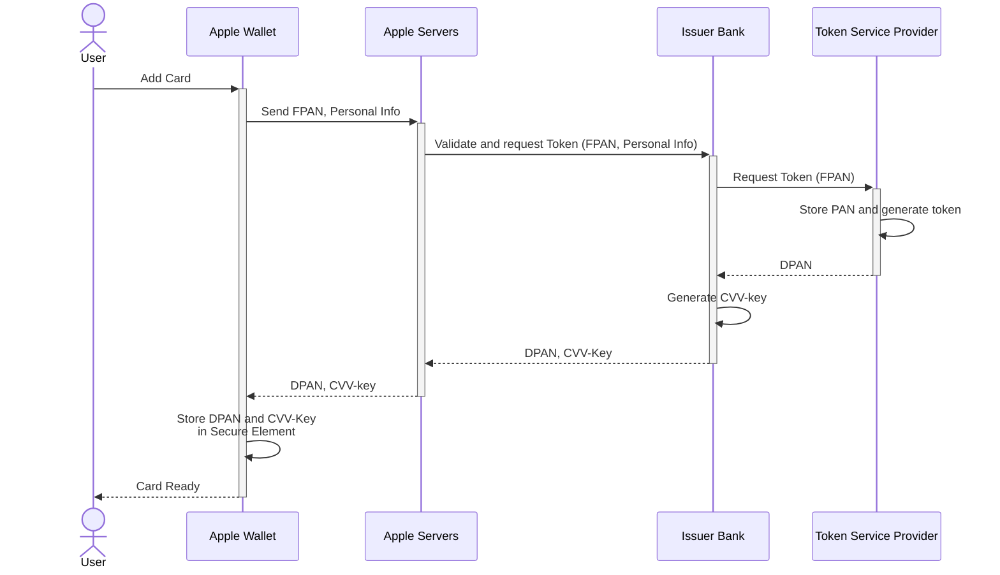

# Apple Pay Overview

Apple Pay is a mobile payment and digital wallet service that offers a convenient and secure way for users to make payments using Apple devices. Merchants can benefit from the enhanced security features of Apple Pay, such as tokenization, which protects sensitive card data during transactions. By integrating with Basis Theory, merchants can leverage advanced Reactors to decrypt and securely store Apple Pay tokens, ensuring compliance with PCI Level 1 standards without the burden of maintaining complex infrastructure. This seamless integration enhances the overall payment processing experience, strengthening customer trust and optimizing operational efficiency. By combining the power of Apple Pay with Basis Theory's robust tools, merchants can unlock a new realm of possibilities in the world of secure transactions.

In this page, we will explore Apple Pay concepts and overall functionality.

## Glossary

- FPAN: Funding Primary Account Number. This is the physical or virtual card number, or just "PAN".
- DPAN: Device Primary Account Number. Apple's equivalent to a Network Token. Also known as  "DAN" or "Application PAN".
- BIN:
- Apple Pay Token: [payment token](https://developer.apple.com/documentation/passkit/apple_pay/payment_token_format_reference) issued by the device upon user approval via biometric authentication (Face ID or Touch ID). It carries transaction information, including an encrypted form of the DPAN and transaction cryptogram.
- Issuer Bank: the financial institution that issues the payment card to the cardholder and is responsible for approving transactions
- TSP: Token Service Provider are entities registered with EMVCo to generate unique replacement values for PANs, aka "tokens". In many cases, these are the Card Networks.
- Secure Element: Industry-standard certified chip present in Apple hardware, such as iPhones, iPads, Apple Watch, etc.

## Adding Card to Apple Wallet

Adding a card to Apple Wallet can either be done by manually adding card details using Apple Wallet UI or using apps that can automatically add cards to the user's wallet - also known as push-provisioning.

Regardless of the method, when a user adds a card to Apple Pay, many systems are involved into ensuring that the sensitive cardholder data is protected and ready to use when it is time to process transactions.

1. Apple Wallet sends the FPAN and the user's personal info to Apple Servers which, after verifying support for the card by looking up BIN tables, sends it to the matching the Issuer Bank, which validates the data and requests a token for the TSP.
2. 

## Using Apple Pay in Transactions

