# Apple Pay Overview

Apple Pay is a mobile payment and digital wallet service that offers a convenient and secure way for users to make payments using Apple devices. Merchants can benefit from the enhanced security features of Apple Pay, such as tokenization, which protects sensitive card data during transactions. For European users, Apple Pay is PSD2 SCA-compliant.

By integrating with Basis Theory, merchants can leverage advanced Reactors to decrypt and securely store Apple Pay tokens, ensuring compliance with PCI Level 1 standards without the burden of maintaining complex infrastructure. This model optimizes operational efficiency by enabling merchants to use native Apple Pay integration in the client side, while getting secured access to the authorized payment credentials.

In this page, we will explore Apple Pay concepts and take a deep dive on how it works. If you are looking for hands-on guides, check out the [Merchant Setup](/docs/guides/apple-pay/setup) and [Accept Payments](/docs/guides/apple-pay/accept) pages we prepared for you.

## Glossary

- **FPAN**: Funding Primary Account Number. This is the physical or virtual card number, or just "PAN".
- **DPAN**: Device Primary Account Number. Apple's equivalent to a Network Token. Also known as  "DAN" or "Application PAN".
- **BIN**: Bank Identifier Number. The first 8 digits of a card number. These are usually preserved when generating DPANs from FPANs.
- **Apple Pay Token**: [payment token object](https://developer.apple.com/documentation/passkit/apple_pay/payment_token_format_reference) issued by the device upon user approval via biometric authentication (Face ID or Touch ID). It carries transaction information, including an encrypted form of the DPAN and transaction cryptogram.
- **Issuer Bank**: the financial institution that issues the payment card to the cardholder and is responsible for approving transactions
- **TSP**: Token Service Provider are entities registered with EMVCo to generate unique replacement values for PANs, aka "tokens". In many cases, these are the Card Networks.
- **Secure Element**: Industry-standard certified chip present in Apple hardware, such as iPhones, iPads, Apple Watch, etc.

## Adding Card to Apple Wallet

Adding a card to Apple Wallet can either be done by manually adding card details using Apple Wallet UI or using apps that can automatically add cards to the user's wallet - also known as push-provisioning.

Regardless of the method, when a user adds a card to Apple Pay, many systems are involved into ensuring that the sensitive cardholder data is protected and ready to use when it is time to process transactions.

1. Apple Wallet sends the FPAN and the user's personal info to Apple Servers which, after verifying support for the card by looking up BIN tables, sends it to the matching Issuer Bank.
2. The Issuer Bank validates the FPAN and sends it to the TSP, requesting a new token.
3. The TSP generates a new DPAN for the received FPAN and stores it next to the FPAN in their token vault. The DPAN and its key are returned to the Issuer Bank.
4. The Issuer Bank generates a CVV-Key which is later used for authorization, and returns all values to Apple Servers
5. Apple Servers securely "returns" the information to Apple Wallet, which stores it in the device's Secure Element ¹.

```mermaid
sequenceDiagram
    actor u as User
    participant aw as Apple Wallet
    participant as as Apple Servers
    participant ib as Issuer Bank
    participant tsp as Token Service Provider

    u ->>+ aw: Add Card
    aw ->>+ as: Send FPAN, Personal Info
    as ->>+ ib: Validate and request Token (FPAN, Personal Info)
    ib ->>+ tsp: Request Token (FPAN)
    tsp ->> tsp: Store PAN and generate token
    tsp -->>- ib: DPAN, Token Key
    ib ->> ib: Generate CVV-key
    ib -->>- as: DPAN, Token Key, CVV-Key
    as -->>- aw: DPAN, Token Key, CVV-key ¹
    aw ->> aw: Store DPAN, Token Key and CVV-Key<br>in Secure Element
    aw -->>- u: Card Ready

```

_¹ The actual mechanism of these steps is proprietary, and were outlined as a return for the sake of comprehension only._

## Using Apple Pay in Transactions

