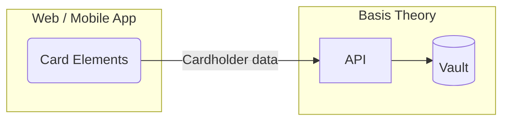

import Tabs from "@theme/Tabs";
import TabItem from "@theme/TabItem";

import { Alert } from "@site/src/components/shared/Alert";
import GettingStartedSection from "@site/src/components/docs/_getting-started-section.mdx";
import ConfigureElementsSection from "@site/src/components/docs/_configure-elements-section.mdx";

# Collect Cards

When building an e-commerce application or subscription service, or enabling one-time purchases, one of the critical requirements is collecting and storing cardholder data securely. However, it can be challenging to navigate the complex regulatory landscape, particularly PCI DSS, and ensure that your application meets all the necessary security standards.

In this guide, we will set up SDKs to capture cards in the frontend, Web or Mobile, and securely store the cardholder data as tokens with the Basis Theory Platform. This will completely remove our user-facing applications from the compliance scope.



## Getting Started

<GettingStartedSection />

### Creating a Public Application

Next you will need you'll need a [Public Application](/docs/api/applications) using our PCI-compliant template `Collect PCI Data`. [Click here to create one.](https://portal.basistheory.com/applications/create?application_template_id=db9148c1-a55f-4164-b830-a20ab6d720ae)

This will create an application with the following [Access Controls](/docs/concepts/access-controls):
* Permissions: `token:create`, `token:update`
* Containers: `/pci/`
* Transform: `mask`

<Alert>
  Save the API Key from the created Public Application as it will be used later in this guide.
</Alert>

## Configuring Basis Theory Elements

<ConfigureElementsSection />

## Adding Card Elements

Once properly installed and configured, add the Card Elements to your application.

<Tabs className="bt-tabs" queryString="sdk">
  <TabItem value="javascript" label="JavaScript">

```html showLineNumbers title=index.html
<div id="cardNumber"></div>
<div style="display: flex">
  <div id="cardExpirationDate"></div>
  <div id="cardVerificationCode"></div>
</div>
```
```javascript showLineNumbers title=index.js
import { BasisTheory } from '@basis-theory/basis-theory-js';

let bt;
//highlight-start
let cardNumberElement;
let cardExpirationDateElement;
let cardVerificationCodeElement;
//highlight-end

(async () => {
  bt = await new BasisTheory().init('test_1234567890', { elements: true });

  //highlight-start
  // Creates Elements instances
  cardNumberElement = bt.createElement('cardNumber', {
    targetId: 'myCardNumber' // (custom) used for tracking validation errors
  });
  cardExpirationDateElement = bt.createElement('cardExpirationDate', {
    targetId: 'myCardExpiration'
  });
  cardVerificationCodeElement = bt.createElement('cardVerificationCode', {
    targetId: 'myCardVerification'
  });
  //highlight-end

  //highlight-start
  // Mounts Elements in the DOM
  await cardNumberElement.mount('#cardNumber');
  await cardExpirationDateElement.mount('#cardExpirationDate');
  await cardVerificationCodeElement.mount('#cardVerificationCode');
  //highlight-end

  //highlight-start
  // Binds card brand to verification code element
  cardNumberElement.on('change', ({ cardBrand }) => {
    cardVerificationCodeElement.update({ cardBrand });
  });
  //highlight-end
})();
```
  </TabItem>
  <TabItem value="react" label="React">

```tsx showLineNumbers title=App.jsx
import React, { useRef, useState } from 'react';
import {
  BasisTheoryProvider,
  // highlight-start
  CardNumberElement,
  CardExpirationDateElement,
  CardVerificationCodeElement,
  //highlight-end
  useBasisTheory,
} from '@basis-theory/basis-theory-react';

export default function App() {
  const { bt } = useBasisTheory('test_1234567890', { elements: true });
  // highlight-next-line
  const [cardBrand, setCardBrand] = useState();
  // highlight-start
  const cardNumberRef = useRef(null);
  const cardExpirationRef = useRef(null);
  const cardVerificationRef = useRef(null);
  // highlight-end

  return (
    <BasisTheoryProvider bt={bt}>
      // highlight-start
      <CardNumberElement
        id="myCardNumber"
        ref={cardNumberRef}
        onChange={({ cardBrand }) => setCardBrand(cardBrand)}
      />
      // highlight-end
      <div style={{ display: 'flex' }}>
        // highlight-start
        <div style={{ width: "100%" }}>
          <CardExpirationDateElement
            id="myCardExpiration"
            ref={cardExpirationRef}
          />
        </div>
        <div style={{ width: "100%" }}>
          <CardVerificationCodeElement
            id="myCardVerification"
            ref={cardVerificationRef}
            cardBrand={cardBrand}
          />
        </div>
        // highlight-end
      </div>
    </BasisTheoryProvider>
  );
}

```
  </TabItem>
  <TabItem value="ios" label="iOS">

```swift showLineNumbers title=ViewController.swift
import Foundation
import UIKit
// highlight-next-line
import BasisTheoryElements
import Combine

class ViewController: UIViewController {
    // highlight-start
    @IBOutlet weak var cardNumberTextField: CardNumberUITextField!
    @IBOutlet weak var expirationDateTextField: CardExpirationDateUITextField!
    @IBOutlet weak var cvcTextField: CardVerificationCodeUITextField!
    // highlight-end

    override func viewDidLoad() {
        super.viewDidLoad()

        // highlight-start
        let cvcOptions = CardVerificationCodeOptions(cardNumberUITextField: cardNumberTextField)
        cvcTextField.setConfig(options: cvcOptions)
        // highlight-end

    }
}
```

  </TabItem>
  <TabItem value="android" label="Android">

```xml showLineNumbers title=res/layout/activity_main.xml
<?xml version="1.0" encoding="utf-8"?>
<androidx.constraintlayout.widget.ConstraintLayout xmlns:android="http://schemas.android.com/apk/res/android"
    xmlns:app="http://schemas.android.com/apk/res-auto"
    xmlns:tools="http://schemas.android.com/tools"
    android:layout_width="match_parent"
    android:layout_height="match_parent"
    tools:context=".MainActivity">

    <LinearLayout
        android:layout_width="match_parent"
        android:layout_height="wrap_content"
        android:layout_margin="20dp"
        android:orientation="vertical"
        app:layout_constraintEnd_toEndOf="parent"
        app:layout_constraintStart_toStartOf="parent"
        app:layout_constraintTop_toTopOf="parent">

      // highlight-start
        <com.basistheory.android.view.CardNumberElement
            android:id="@+id/card_number"
            android:layout_width="match_parent"
            android:layout_height="wrap_content" />
      // highlight-end
    </LinearLayout>

</androidx.constraintlayout.widget.ConstraintLayout>
```

  </TabItem>
</Tabs>

### Using a single Card Element
Alternatively, you can declare a single Card Element that features all three basic cardholder data inputs in a single element.


<Tabs className="bt-tabs" queryString="sdk">
  <TabItem value="javascript" label="JavaScript">

```javascript showLineNumbers
import { BasisTheory } from '@basis-theory/basis-theory-js';

let bt;
//highlight-start
let cardElement;
//highlight-end

(async () => {
  bt = await new BasisTheory().init('test_1234567890', { elements: true });
  //highlight-start
  cardElement = bt.createElement('card');
  // here #myCard is a DOM selector
  // example: <div id="myCard"></div>
  await cardElement.mount('#myCard');
  //highlight-end
})();
```
  </TabItem>
  <TabItem value="react" label="React">
  </TabItem>
  <TabItem value="ios" label="iOS">

```text
CardElement is not yet available for iOS. If you need this feature, please let us know.

https://basistheory.com/contact
```
  </TabItem>
  <TabItem value="android" label="Android">

```text
CardElement is not yet available for Android. If you need this feature, please let us know.

https://basistheory.com/contact
```
  </TabItem>
</Tabs>
