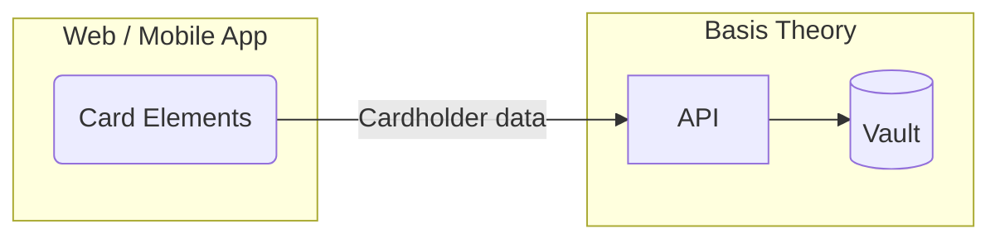

import Tabs from "@theme/Tabs";
import TabItem from "@theme/TabItem";

import { Alert } from "@site/src/components/shared/Alert";
import GettingStartedSection from "@site/src/components/docs/_getting-started-section.mdx";
import ConfigureElementsSection from "@site/src/components/docs/_configure-elements-section.mdx";

# Collect Cards

When building an e-commerce application or subscription service, or enabling one-time purchases, one of the critical requirements is collecting and storing cardholder data securely. However, it can be challenging to navigate the complex regulatory landscape, particularly PCI DSS, and ensure that your application meets all the necessary security standards.

In this guide, we will set up SDKs to capture cards in the frontend, Web or Mobile, and securely store the cardholder data as tokens with the Basis Theory Platform. This will completely remove our user-facing applications and database from the compliance scope.



## Getting Started

<GettingStartedSection />

### Creating a Public Application

Next you will need you'll need a [Public Application](/docs/api/applications) using our PCI-compliant template `Collect PCI Data`. [Click here to create one.](https://portal.basistheory.com/applications/create?application_template_id=db9148c1-a55f-4164-b830-a20ab6d720ae)

This will create an application with the following [Access Controls](/docs/concepts/access-controls):
* Permissions: `token:create`, `token:update`
* Containers: `/pci/`
* Transform: `mask`

<Alert>
  Save the API Key from the created Public Application as it will be used later in this guide.
</Alert>

## Configuring Basis Theory Elements

<ConfigureElementsSection />

## Adding Card Elements

Once properly installed and configured, add the Card Elements to your application. This will enable users to type in their card data in your form, while refraining from your systems to come in contact with it.

<Tabs className="bt-tabs" queryString="sdk">
  <TabItem value="javascript" label="JavaScript">

```html showLineNumbers title=index.html
<div id="cardNumber"></div>
<div style="display: flex;">
  <div id="cardExpirationDate" style="width: 100%;"></div>
  <div id="cardVerificationCode" style="width: 100%;"></div>
</div>
```
```javascript showLineNumbers title=index.js
import { BasisTheory } from '@basis-theory/basis-theory-js';

let bt;
let cardNumberElement;
let cardExpirationDateElement;
let cardVerificationCodeElement;

async function init() {
  bt = await new BasisTheory().init('test_1234567890', { elements: true });

  //highlight-start
  // Creates Elements instances
  cardNumberElement = bt.createElement('cardNumber', {
    targetId: 'myCardNumber' // (custom) used for tracking validation errors
  });
  cardExpirationDateElement = bt.createElement('cardExpirationDate', {
    targetId: 'myCardExpiration'
  });
  cardVerificationCodeElement = bt.createElement('cardVerificationCode', {
    targetId: 'myCardVerification'
  });
  //highlight-end

  //highlight-start
  // Mounts Elements in the DOM in parallel
  await Promise.all([
    cardNumberElement.mount('#cardNumber'),
    cardExpirationDateElement.mount('#cardExpirationDate'),
    cardVerificationCodeElement.mount('#cardVerificationCode'),
  ]);
  //highlight-end

  //highlight-start
  // Binds card brand to verification code element
  cardNumberElement.on('change', ({ cardBrand }) => {
    cardVerificationCodeElement.update({ cardBrand });
  });
  //highlight-end
}

init();
```
  </TabItem>
  <TabItem value="react" label="React">

```jsx showLineNumbers title=App.jsx
import React, { useRef, useState } from 'react';
import {
  BasisTheoryProvider,
  // highlight-start
  CardNumberElement,
  CardExpirationDateElement,
  CardVerificationCodeElement,
  //highlight-end
  useBasisTheory,
} from '@basis-theory/basis-theory-react';

export default function App() {
  const { bt } = useBasisTheory('test_1234567890', { elements: true });
  // highlight-start
  // Refs to get access to the Elements instance
  const cardNumberRef = useRef(null);
  const cardExpirationRef = useRef(null);
  const cardVerificationRef = useRef(null);
  // highlight-end

  // highlight-start
  // stores the current card brand in state, to pass to CardVerificationCodeElement
  const [cardBrand, setCardBrand] = useState();
  // highlight-end

  return (
    <BasisTheoryProvider bt={bt}>
      // highlight-start
      <CardNumberElement
        id="myCardNumber"
        ref={cardNumberRef}
        onChange={({ cardBrand }) => setCardBrand(cardBrand)}
      />
      // highlight-end
      <div style={{ display: 'flex' }}>
        <div style={{ width: "100%" }}>
          // highlight-start
          <CardExpirationDateElement
            id="myCardExpiration"
            ref={cardExpirationRef}
          />
          // highlight-end
        </div>
        <div style={{ width: "100%" }}>
          // highlight-start
          <CardVerificationCodeElement
            id="myCardVerification"
            ref={cardVerificationRef}
            cardBrand={cardBrand}
          />
          // highlight-end
        </div>
      </div>
    </BasisTheoryProvider>
  );
}
```
  </TabItem>
  <TabItem value="ios" label="iOS">

```swift showLineNumbers title=ViewController.swift
import Foundation
import UIKit
// highlight-next-line
import BasisTheoryElements
import Combine

class ViewController: UIViewController {
    // highlight-start
    @IBOutlet weak var cardNumberTextField: CardNumberUITextField!
    @IBOutlet weak var expirationDateTextField: CardExpirationDateUITextField!
    @IBOutlet weak var cvcTextField: CardVerificationCodeUITextField!
    // highlight-end

    override func viewDidLoad() {
        super.viewDidLoad()

        // highlight-start
        // Binds card brand to verification code element
        let cvcOptions = CardVerificationCodeOptions(cardNumberUITextField: cardNumberTextField)
        cvcTextField.setConfig(options: cvcOptions)
        // highlight-end
    }
}
```

  </TabItem>
  <TabItem value="android" label="Android">

```xml showLineNumbers title=activity_main.xml
<?xml version="1.0" encoding="utf-8"?>
<androidx.constraintlayout.widget.ConstraintLayout xmlns:android="http://schemas.android.com/apk/res/android"
    xmlns:app="http://schemas.android.com/apk/res-auto"
    xmlns:tools="http://schemas.android.com/tools"
    android:layout_width="match_parent"
    android:layout_height="match_parent"
    tools:context=".MainActivity">

    <LinearLayout
        android:layout_width="match_parent"
        android:layout_height="wrap_content"
        android:layout_margin="20dp"
        android:orientation="vertical"
        app:layout_constraintEnd_toEndOf="parent"
        app:layout_constraintStart_toStartOf="parent"
        app:layout_constraintTop_toTopOf="parent">

      // highlight-start
        <com.basistheory.android.view.CardNumberElement
            android:id="@+id/card_number"
            android:layout_width="match_parent"
            android:layout_height="wrap_content" />
        <com.basistheory.android.view.CardExpirationDateElement
            android:id="@+id/expiration_date"
            android:layout_width="match_parent"
            android:layout_height="wrap_content" />
        <com.basistheory.android.view.CardVerificationCodeElement
            android:id="@+id/cvc"
            android:layout_width="match_parent"
            android:layout_height="wrap_content" />
      // highlight-end
    </LinearLayout>

</androidx.constraintlayout.widget.ConstraintLayout>
```
```kotlin showLineNumbers title=MainActivity.kt
class MainActivity : AppCompatActivity() {

    // highlight-start
    private lateinit var cardNumberElement: CardNumberElement
    private lateinit var cardExpirationDateElement: CardExpirationDateElement
    private lateinit var cardVerificationCodeElement: CardVerificationCodeElement
    // highlight-end

    override fun onCreate(savedInstanceState: Bundle?) {
        super.onCreate(savedInstanceState)
        setContentView(R.layout.activity_main)

        // highlight-start
        cardNumberElement = findViewById(R.id.card_number)
        cardExpirationDateElement = findViewById(R.id.expiration_date)
        cardVerificationCodeElement = findViewById(R.id.cvc)

        // Binds card brand to verification code element
        cardVerificationCodeElement.cardNumberElement = cardNumberElement
        // highlight-end
    }
}
```

  </TabItem>
</Tabs>

### Using a single Card Element
Alternatively, you can declare a single Card Element that features all three basic cardholder data inputs in a single element.


<Tabs className="bt-tabs" queryString="sdk">
  <TabItem value="javascript" label="JavaScript">

```html showLineNumbers title=index.html
<div id="card"></div>
```

```javascript showLineNumbers title=index.js
import { BasisTheory } from '@basis-theory/basis-theory-js';

let bt;
//highlight-start
let cardElement;
//highlight-end

async function init () {
  bt = await new BasisTheory().init('test_1234567890', { elements: true });
  //highlight-start
  cardElement = bt.createElement('card');
  await cardElement.mount('#card');
  //highlight-end
};

init();
```
  </TabItem>
  <TabItem value="react" label="React">

```jsx showLineNumbers title=App.jsx
import React, { useRef } from 'react';
import {
  BasisTheoryProvider,
  // highlight-next-line
  CardElement,
  useBasisTheory,
} from '@basis-theory/basis-theory-react';

export default function App() {
  const { bt } = useBasisTheory('test_1234567890', { elements: true });
  // highlight-start
  // Ref to get access to the Element instance
  const cardRef = useRef(null);
  // highlight-end

  return (
    <BasisTheoryProvider bt={bt}>
      // highlight-start
      <CardElement
        id="myCard"
        ref={cardRef}
      />
      // highlight-end
    </BasisTheoryProvider>
  );
}
```
  </TabItem>
  <TabItem value="ios" label="iOS">

```text
CardElement is not yet available for iOS. If you need this feature, please let us know.

https://basistheory.com/contact
```
  </TabItem>
  <TabItem value="android" label="Android">

```text
CardElement is not yet available for Android. If you need this feature, please let us know.

https://basistheory.com/contact
```
  </TabItem>
</Tabs>

## Storing Cards

Now that you are securely capturing the cardholder data in your user-facing application(s), it is time to store it in your Basis Theory Tenant.

To do this, we will call the [Create Token](https://developers.basistheory.com/docs/api/tokens/#create-token) endpoint from the SDK, passing the Card Elements as data points in the payload. This way, the card information is securely transferred from the frontend Elements to the Basis Theory vault, where they will reside in the encrypted form.

Add a submit function along with a button to trigger it:

<Tabs className="bt-tabs" queryString="sdk">
  <TabItem value="javascript" label="JavaScript">

```html showLineNumbers title=index.html
<div id="cardNumber"></div>
<div style="display: flex;">
  <div id="cardExpirationDate" style="width: 100%;"></div>
  <div id="cardVerificationCode" style="width: 100%;"></div>
</div>
// highlight-next-line
<button onclick="submit();">Submit</button>
```
```javascript showLineNumbers title=index.js
import { BasisTheory } from '@basis-theory/basis-theory-js';

let bt;
let cardNumberElement;
let cardExpirationDateElement;
let cardVerificationCodeElement;

async function init () { ... }

// highlight-start
async function submit () {
  try {
    const token = await bt.tokens.create({
      type: 'card',
      data: {
        number: cardNumberElement,
        expiration_month: cardExpirationDateElement.month(),
        expiration_year: cardExpirationDateElement.year(),
        cvc: cardVerificationCodeElement,
      }
    });
    // store token.id in your database
  } catch (error) {
    console.error(error);
  }
}
// highlight-end

init();
```
  </TabItem>
  <TabItem value="react" label="React">

```jsx showLineNumbers title=App.jsx
import React, { useRef, useState } from 'react';
import {
  BasisTheoryProvider,
  CardNumberElement,
  CardExpirationDateElement,
  CardVerificationCodeElement,
  useBasisTheory,
} from '@basis-theory/basis-theory-react';

export default function App() {
  const { bt } = useBasisTheory('test_1234567890', { elements: true });
  // Refs to get access to the Elements instance
  const cardNumberRef = useRef(null);
  const cardExpirationRef = useRef(null);
  const cardVerificationRef = useRef(null);
  // stores the current card brand in state, to pass to CardVerificationCodeElement
  const [cardBrand, setCardBrand] = useState();

  // highlight-start
  const submit = async () => {
    try {
      const token = await bt.tokens.create({
        type: 'card',
        data: {
          number: cardNumberRef.current,
          expiration_month: cardExpirationRef.month(),
          expiration_year: cardExpirationRef.year(),
          cvc: cardVerificationRef.current,
        }
      });
      // store token.id in your database
    } catch (error) {
      console.error(error);
    }
  }
  // highlight-end

  return (
    <BasisTheoryProvider bt={bt}>
      ...
      // highlight-next-line
      <button onClick={submit}>Submit</button>
    </BasisTheoryProvider>
  );
}
```
  </TabItem>
  <TabItem value="ios" label="iOS">

```swift showLineNumbers title=ViewController.swift
import Foundation
import UIKit
// highlight-next-line
import BasisTheoryElements
import Combine

class ViewController: UIViewController {
    @IBOutlet weak var cardNumberTextField: CardNumberUITextField!
    @IBOutlet weak var expirationDateTextField: CardExpirationDateUITextField!
    @IBOutlet weak var cvcTextField: CardVerificationCodeUITextField!

    // highlight-start
      @IBAction func tokenize(_ sender: Any) {
        let body: [String: Any] = [
            "type": "card",
            "data": [
                "number": self.cardNumberTextField,
                "expiration_month": self.expirationDateTextField.month(),
                "expiration_year": self.expirationDateTextField.year(),
                "cvc": self.cvcTextField
            ]
        ]

        BasisTheoryElements.tokenize(body: body, apiKey: config.btApiKey!) { token, error in
            guard error == nil else {
                print(error)
                return
            }
            // store token.id in your database
        }
    }
    // highlight-end

    override func viewDidLoad() { ... }

}
```

  </TabItem>
  <TabItem value="android" label="Android">

```xml showLineNumbers title=activity_main.xml
<?xml version="1.0" encoding="utf-8"?>
<androidx.constraintlayout.widget.ConstraintLayout xmlns:android="http://schemas.android.com/apk/res/android"
    xmlns:app="http://schemas.android.com/apk/res-auto"
    xmlns:tools="http://schemas.android.com/tools"
    android:layout_width="match_parent"
    android:layout_height="match_parent"
    tools:context=".MainActivity">

    <LinearLayout
        android:layout_width="match_parent"
        android:layout_height="wrap_content"
        android:layout_margin="20dp"
        android:orientation="vertical"
        app:layout_constraintEnd_toEndOf="parent"
        app:layout_constraintStart_toStartOf="parent"
        app:layout_constraintTop_toTopOf="parent">

        ...

      // highlight-start
        <Button
            android:id="@+id/submit_button"
            android:layout_width="wrap_content"
            android:layout_height="wrap_content"
            android:layout_marginTop="20dp"
            android:backgroundTint="#00A4BA"
            android:text="Submit" />
      // highlight-end
    </LinearLayout>

</androidx.constraintlayout.widget.ConstraintLayout>
```
```kotlin showLineNumbers title=MainActivity.kt
class MainActivity : AppCompatActivity() {

    private lateinit var cardNumberElement: CardNumberElement
    private lateinit var cardExpirationDateElement: CardExpirationDateElement
    private lateinit var cardVerificationCodeElement: CardVerificationCodeElement
    // highlight-start
    private lateinit var button: Button;

    private val bt = BasisTheoryElements.builder()
        .apiKey("test_1234567890")
        .build()
    // highlight-end


    override fun onCreate(savedInstanceState: Bundle?) {
        super.onCreate(savedInstanceState)
        setContentView(R.layout.activity_main)

        cardNumberElement = findViewById(R.id.card_number)
        cardExpirationDateElement = findViewById(R.id.expiration_date)
        cardVerificationCodeElement = findViewById(R.id.cvc)
        // highlight-start
        button = findViewById(R.id.submit_button)
        button.setOnClickListener {
            submit()
        }
        // highlight-end

        // Binds card brand to verification code element
        cardVerificationCodeElement.cardNumberElement = cardNumberElement
    }

    // highlight-start
    private fun submit() {
      val token = runBlocking {
        bt.tokens.create(object {
          val type = "card"
          val data = object {
            val number = cardNumberElement
            val expiration_month = cardExpirationDateElement.month()
            val expiration_year = cardExpirationDateElement.year()
            val cvc = cardVerificationCodeElement
          }
        })
      }
      // store token.id in your database
    }
    // highlight-end
}
```

  </TabItem>
</Tabs>

## Customizing the Card Token

### Deduplication

### Aliasing

### Masking

## Conclusion


