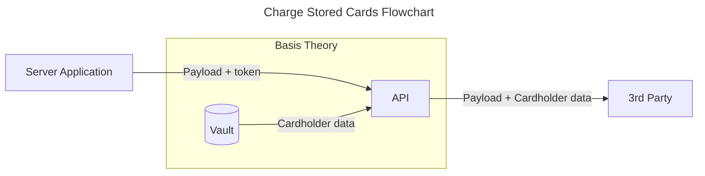

import GettingStartedSection from "@site/src/components/docs/_getting-started-section.mdx";

# Charge Stored Cards

Storing your customers' cards with Basis Theory platform grants you the ability to seamlessly shift between payment processors, giving you competitive advantages including payment flexibility, reliability, cost savings, increased acceptance rates and future-proofing your business in case of processor shutdown.

This guide will explore how to forward stored cardholder data to any third party API endpoint, with minimal configuration requirements.

If you are not yet storing your customers' cards with Basis Theory, here are a few guides you can explore:

- [Collect Cards](/docs/guides/collect/collect-cards) - capture cards in the frontend;
- [Receive Cards](/docs/guides/share/reveal-data-from-third-party) - receive cards in API requests;
- [Import from a Database](/docs/blueprints/migrations/import-from-database) - migrate to Basis Theory.

[//]: # (Replace #2 link above with "Receive Cards" when the guide is available)
[//]: # (Replace #3 link above with "Migrating from a Payments Processor" when the guide is available)

## Getting Started

<GettingStartedSection />

### Creating a Private Application

Next you will need you'll need a [Private Application](/docs/api/applications) using our PCI-compliant template `Use PCI Tokens`. [Click here to create one.](https://portal.basistheory.com/applications/create?application_template_id=31efed55-035c-4b49-b1a1-609a728d91ce)

This will create an application with the following [Access Controls](/docs/concepts/access-controls):
* Permissions: `token:use`
* Containers: `/pci/`
* Transform: `reveal`

<Alert>
  Save the API Key from the created Private Application as it will be used later in this guide.
</Alert>

