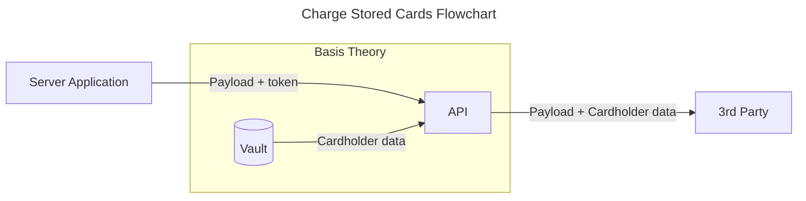

# Charge Stored Cards

Storing your customers' cards with Basis Theory platform grants you the ability to seamlessly shift between payment processors, giving you competitive advantages including payment flexibility, reliability, cost savings, increased acceptance rates and future-proofing your business in case of processor shutdown.

This guide will explore how to forward stored cardholder data to any third party API endpoint, with minimal configuration requirements. If you are not yet securing your customers' cards with Basis Theory yet, here are a few options you can explore:

- [Collect Cards](/docs/guides/collect/collect-cards) - shows how to capture cards in the frontend and store them securely;
- [Receive Cards](/docs) - shows how to

