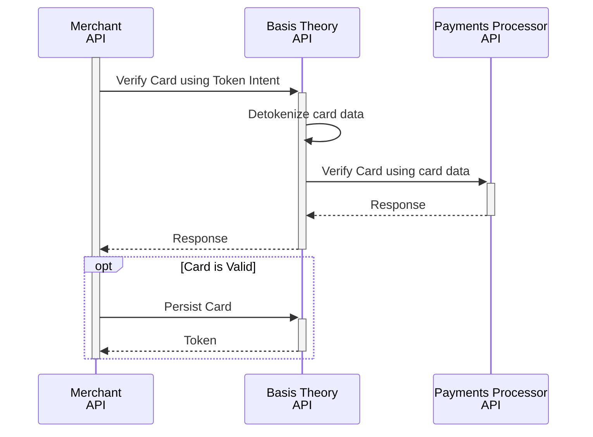

import { Intro } from "@site/src/components/shared/Intro";
import GettingStartedSection from "@site/src/components/docs/_getting-started-section.mdx";
import CollectCardsSection from "./sections/_collect-cards-section.mdx";
import PrivateApplicationSection from "./sections/_private-application-section.mdx"
import VerifyCardSection from "./sections/_verify-card-section.mdx";
import PersistCardSection from "./sections/_persist-card-section.mdx";

<Intro
  title="Add Card on File"
  caption="Implement an Add Card on File experience using secure Elements to collect and process card payments."
/>

When building an e-commerce application, subscription service, or enabling one-time purchases, securely collecting and managing cardholder data is essential. Beyond security, merchants often face the challenge of optimizing payments orchestration, relying on multiple processors to ensure global coverage, disaster recovery, and authentication failover. Basis Theory platform has been uniquely designed to simplify both payment orchestration and secure data handling.

TODO: add example add card on file image with disclaimer

In this guide, you'll learn how to use Basis Theory platform to capture and verify cardholder data from a customer, and tokenize it securely for later charging it.

<GettingStartedSection />

<CollectCardsSection />

## Process Cards

In this section, we'll explore how to verify a card and securely persist it for future transactions.

We will use Basis Theory [Ephemeral Proxy API](/docs/api/proxies/ephemeral-proxy), a tool that transparently performs detokenization, to share the sensitive cardholder data to the Payments Processor or Acquirer API. To do this, we will formulate our HTTPS request as if we were directly connecting to the target endpoint, with the following variations:

1. Use a [Private Application Key](#private-application) as the value of the `BT-API-KEY` header;
2. Specify the target API endpoint as the value for the `BT-PROXY-URL` header;
3. Pass any additional headers you need the target API to receive, for example `Authorization`, `X-API-KEY`, etc.;
4. Replace the plaintext sensitive cardholder data in the expected payload contents with [detokenization expressions](/docs/expressions/detokenization) that contains token identifiers.

Continue reading to find request examples in the subsections below.

<PrivateApplicationSection />

<VerifyCardSection />

<PersistCardSection />
