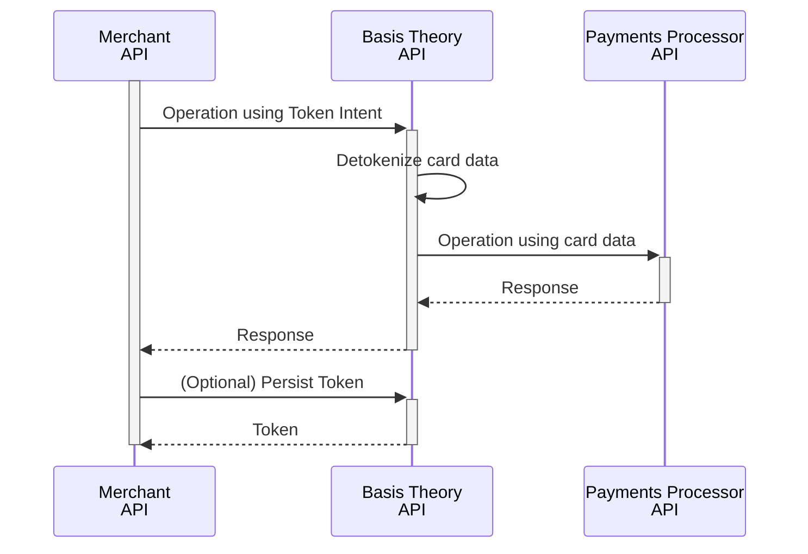

import {
  CardElement,
} from "@basis-theory/basis-theory-react";

import GettingStartedSection from "@site/src/components/docs/_getting-started-section.mdx";
import { BasisTheoryComponentDisplay } from "@site/src/components/sdks/BasisTheoryComponentDisplay";
import { Intro } from "@site/src/components/shared/Intro";
import CollectCardsSection from "./sections/_collect-cards-section.mdx";
import PrivateApplicationSection from "./sections/_private-application-section.mdx"
import VerifyCardSection from "./sections/_verify-card-section.mdx";

<Intro
  title="Cards Checkout"
  caption="Implement a checkout experience using secure Elements to collect and process card payments."
/>

When building an e-commerce application, subscription service, or enabling one-time purchases, securely collecting and managing cardholder data is essential. Beyond security, merchants often face the challenge of optimizing payments orchestration—relying on multiple processors to ensure global coverage, disaster recovery, and authentication failover. Basis Theory platform has been uniquely designed to simplify both payment orchestration and secure data handling.

<BasisTheoryComponentDisplay title="Live Card Element">
  <CardElement id="card-element" />
</BasisTheoryComponentDisplay>

In this guide, you'll learn how to use Basis Theory platform to capture cardholder data from a consumer, tokenize it securely, and leverage it for seamless processor integrations. By following this step-by-step guide, you'll streamline your payment workflows while minimizing your exposure to PCI DSS compliance requirements.

<GettingStartedSection />

<CollectCardsSection />

## Process Cards

In this section, we'll explore key backend operations involved in working with cards that you can choose to perform according to your use case. Properly implementing these operations is an essential step for achieving a fully agnostic and independent payment processing strategy, enabling flexibility and control over your payment workflows.

We will use Basis Theory [Ephemeral Proxy API](/docs/api/proxies/ephemeral-proxy), a tool that transparently performs detokenization, to share the sensitive cardholder data to the Payments Processor or Acquirer API. To do this, we will formulate our HTTPS request as if we were directly connecting to the target endpoint, with the following variations:

1. Use a Private Application Key as the value of the `BT-API-KEY` header;
2. Specify the target API endpoint as the value for the `BT-PROXY-URL` header;
3. Pass any additional headers you need the target API to receive, for example `Authorization`, `X-API-KEY`, etc.;
4. Replace the plaintext sensitive cardholder data in the expected payload contents with [detokenization expressions](/docs/expressions/detokenization) that contains token identifiers.

Continue reading to find request examples in the subsections below.

<PrivateApplicationSection />

<VerifyCardSection />

### Charge a Card

### Persist a Card

