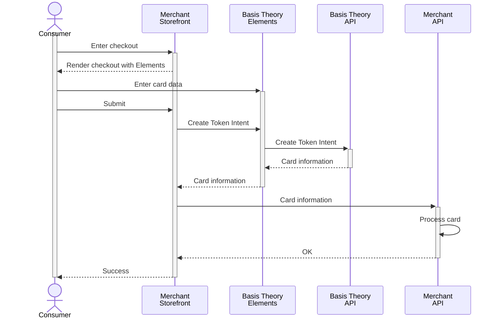

import ConfigureElementsSection from "@site/src/components/docs/_configure-elements-section.mdx";
import PublicApplicationSection from "./_public-application-section.mdx";
import AddElementsSection from "./_add-elements-section.mdx";
import TokenizationSection from "./_tokenization-section.mdx";
import AuthenticateCardSection from "./_authenticate-card-section.mdx";

## Collect Cards

In this section, we will set up Basis Theory SDKs to capture cards in a frontend application, Web or Mobile, and securely store the cardholder data as flexible and agnostic token intents within your Basis Theory vault.

<PublicApplicationSection />

### Configure Elements SDK

<ConfigureElementsSection />

<AddElementsSection/>

<TokenizationSection />

<AuthenticateCardSection />
