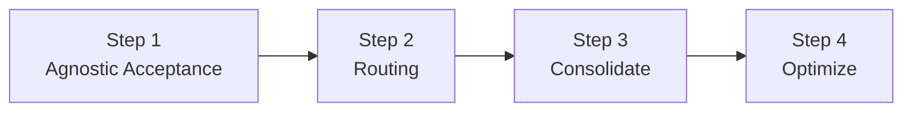

import { Intro } from "@site/src/components/shared/Intro";

<Intro
  title="Card Payments"
  caption="Learn how to introduce Basis Theory into your Payments Stack"
  img={{
    light: "/img/guides/cards/logo.svg",
    dark: "/img/guides/cards/logo-dark.svg",
  }}
/>

Adopting Basis Theory

### Step 1 - Agnostic Acceptance

One Form. Any Gateway. Maximum Conversions.

- PCI compliance
- No more toggling or switching between many PSP frontends / replace Processor iframed components
- Agnostic 3DS
- 100% uptime iframe guarantee
  - Fallback writing

### Step 2 - Route to your existing processor

New customers:
1. Charge intent and save token(s)
2. Verify intent, save token(s), charge token
- Tokenize only valid cards
- Pick a PSP for verification ($0 auth)

Returning customers:
1. Render card, recollect cvc, charge token

Subscriptions:
1. Charge token

### Step 3 - Migrate cards to Basis Theory
- Bring all cards under the same roof

### Step 4 - Optimize
- Add new PSP
- Add routing logic
  - Region
  - funding type
  - Retries

---

Pick a checkout flow:

### Direct Card Payments
1. Accept Cards
   - (Optional) Authenticate with 3DS
2. Charge a new Card
   - Produces PSP token, NT TX ID (store them)
3. (Optional) Save a Card

### Verify and Charge cards
1. Accept Cards
   - (Optional) Authenticate with 3DS
2. Verify a Card
   - Produces PSP token, NT TX ID (store them)
3. Save a Card
   - Produces BT Token ID (store it)
4. Charge a Card
   - Using PSP Token
   - Using BT Token + NT TX ID (fallback)

### Pay with Saved Cards
1. Using a PSP Token (if you have one)
2. Using a BT Token
   - Recollect CVC (if needed)
   - Charge token

---

Match your stack:

### Frontend guides
1. Accept Cards
2. Authenticate with 3DS
3. Recollect CVC

### Backend guides
1. Verify a Card
2. Charge a new Card
3. Save a Card
4. Charge a saved Card
