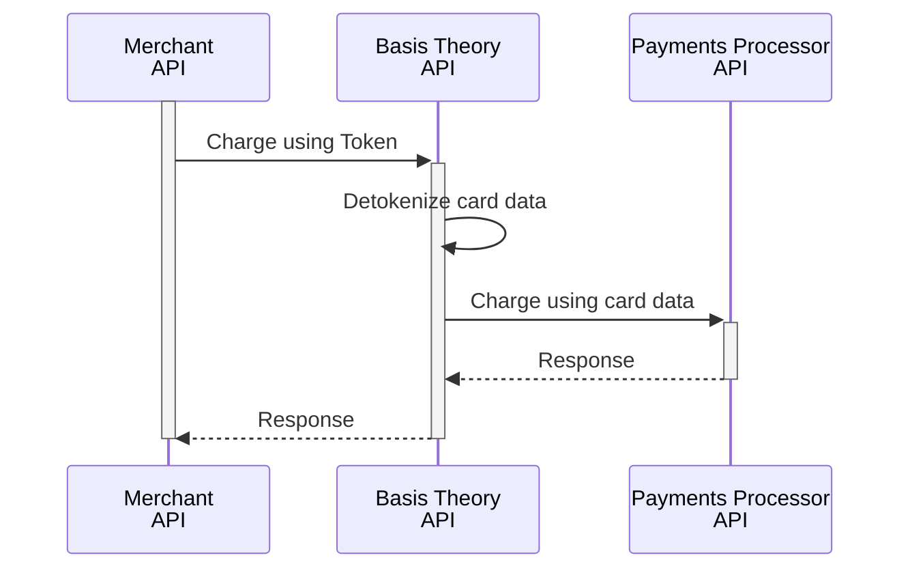

import { Intro } from "@site/src/components/shared/Intro";
import { ApplicationSection } from "./sections/ApplicationSection";
import RecollectSecurityCodeSection from "./sections/_recollect-security-code_section.mdx";
import ChargeSavedCardSection from "./sections/_charge-saved-card-section.mdx";

<Intro
  title="Pay with Saved Cards"
  caption="Implement an express checkout experience to process saved card payments."
/>

Enabling customers to pay with saved cards offers a convenient and secure checkout process, helping reduce cart abandonment. As a Customer-Initiated Transaction (CIT), it requires the cardholder's active participation, ensuring security compliance while delivering a seamless experience. This guide shows how to implement these efficient payment flows using previously saved tokens.

TODO add image of checkout selecting saved card

If you are not yet tokenizing cards with Basis Theory, here are a few guides that you can explore:

- [Accept Card Payments](/docs/payments/accept-card-payments) - start collecting cards in your checkout page
- [Add Card on File](/docs/payments/add-card-on-file) - enable customers to add cards to their profile or wallet
- [Import Cards from a Payments Processor](/docs/blueprints/migrations/import-cards-on-file) - migrate to Basis Theory

## Merchant Tokens

Merchant Tokens are agnostic references to cards stored in a vault that can be used with any 3rd parties, such as payments processors. In this section, we will explore how to charge a saved card in a checkout workflow.

Suppose your application identified a returning customer that has tokens in your database, render the saved card options to the customer, allowing them to select one to proceed with the express checkout. For example:

| CUSTOMER_ID | BT_CARD_TOKEN                          | NT_TX_ID                           | CARD_BRAND   | CARD_EXP | CARD_LAST4 |
|-------------|----------------------------------------|------------------------------------|--------------|----------|------------|
| `a7c9f2b4`  | `1cd9c8bf-99fd-4784-ba69-68b15b301019` | `8723dfab9c4e56a1b8cd0291ef67ac43` | _VISA_       | 01/30    | 4242       |
| `f4b1d8e7`  | `4fa8e7c6-33bf-4420-bb1d-2c4e5d872301` | `9a3f7edbc1246a8b5e0d3c12fa678943` | _MASTERCARD_ | 12/29    | 5555       |

<RecollectSecurityCodeSection />

## Process Cards

In this section, we'll learn how to process a payment using a saved card token.

We will use Basis Theory [Ephemeral Proxy API](/docs/api/proxies/ephemeral-proxy), a tool that transparently performs detokenization, to share the sensitive cardholder data to the Payments Processor or Acquirer API. To do this, we will formulate our HTTPS request as if we were directly connecting to the target endpoint, with the following variations:

1. Use a [Private Application Key](#private-application) as the value of the `BT-API-KEY` header;
2. Specify the target API endpoint as the value for the `BT-PROXY-URL` header;
3. Pass any additional headers you need the target API to receive, for example `Authorization`, `X-API-KEY`, etc.;
4. Replace the plaintext sensitive cardholder data in the expected payload contents with [detokenization expressions](/docs/expressions/detokenization) that contains token identifiers.

Continue reading to find request examples in the subsections below.

### Private Application

<ApplicationSection type="private" permissions={['token:use']}/>

<ChargeSavedCardSection />

## PSP Tokens

