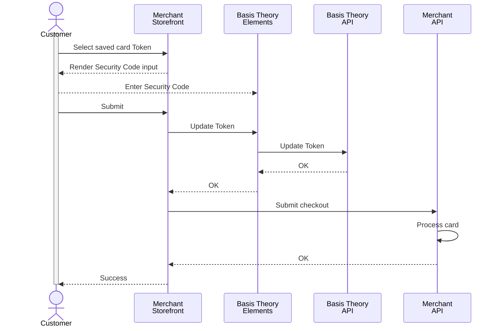

import ConfigureElementsSection from "@site/src/components/docs/_configure-elements-section.mdx";
import AddCvcElementSection from "./_add-cvc-element-section.mdx";
import UpdateTokenCvcSection from "./_update_token_cvc_section.mdx"
import { ApplicationSection } from "./ApplicationSection";

## Recollect Security Code

To improve authorization rates, some PSPs recommend, or even require, that CITs performed with saved cards include the card security code (CSC, also known as CVV or CVC). Since long-term persisted Tokens can't store Security Code per PCI Compliance, merchants have the option to recollect it from the customer.

### Public Application

<ApplicationSection type="public" permissions={["token:update"]} />

### Configure Elements SDK

<ConfigureElementsSection />

<AddCvcElementSection />

<UpdateTokenCvcSection />
